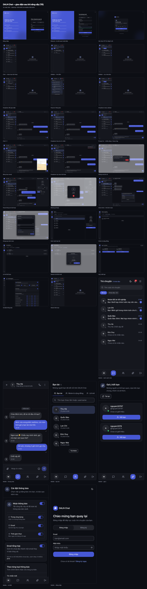
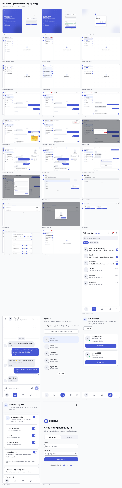
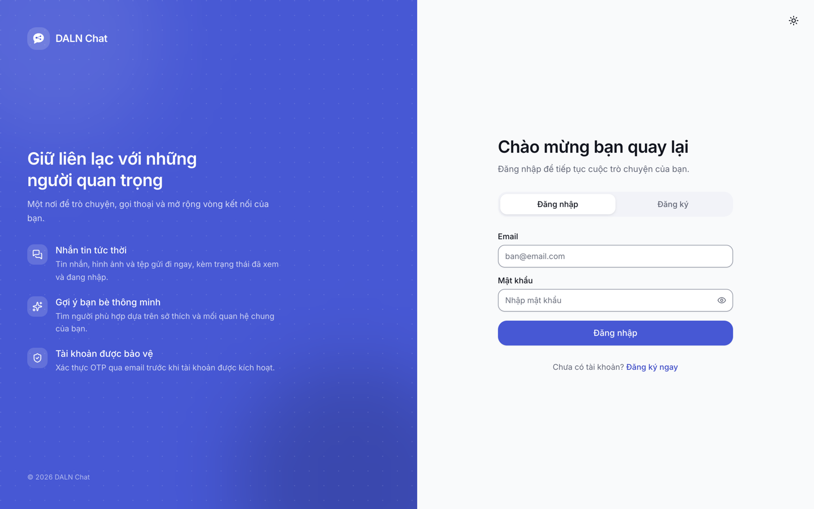
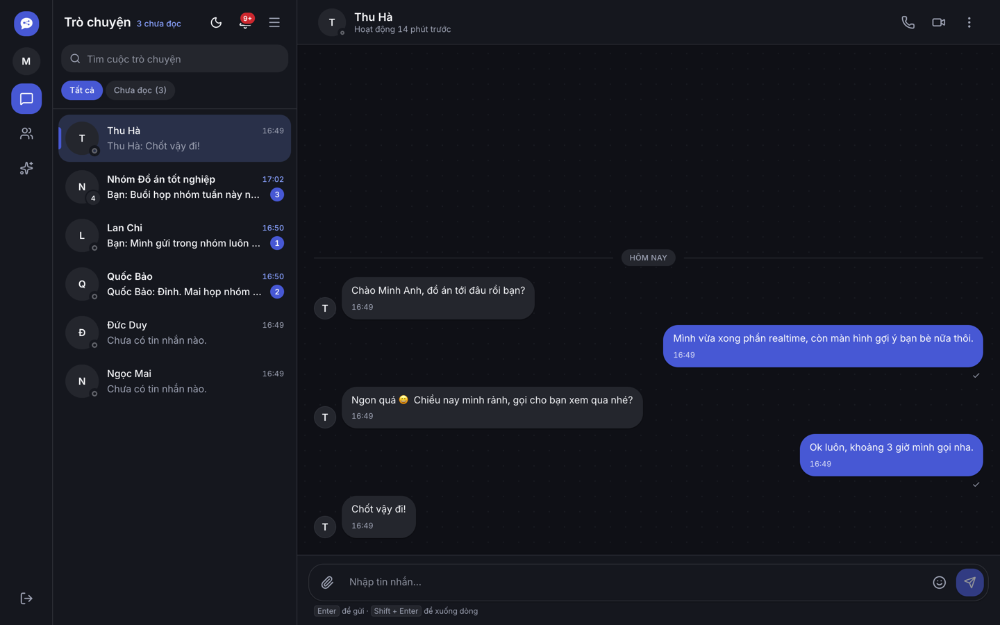
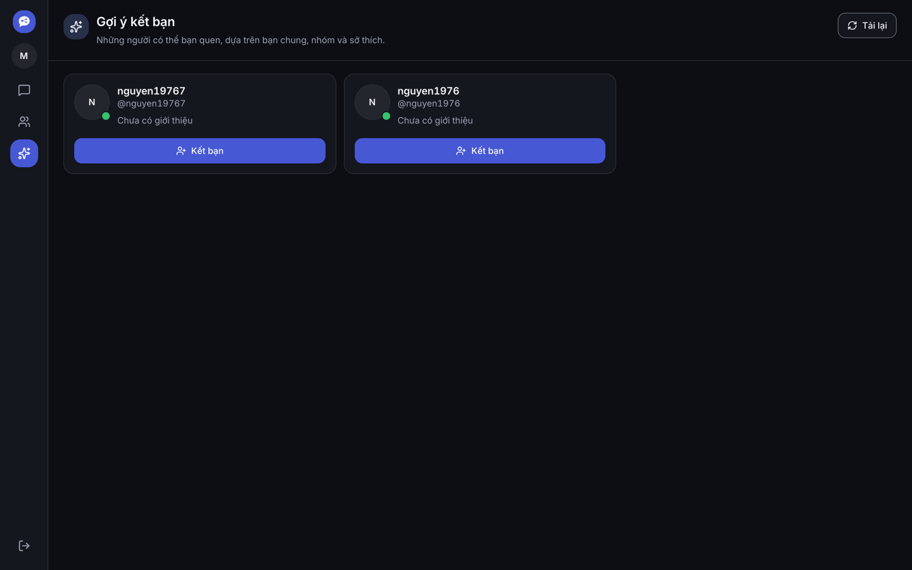
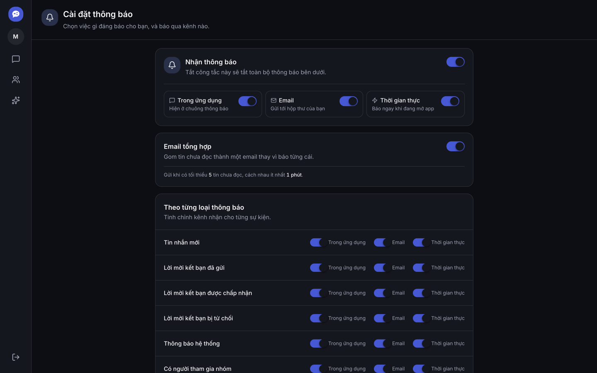
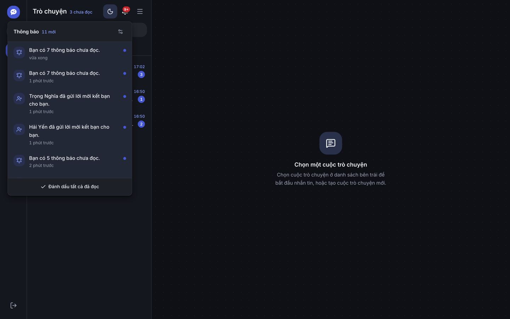
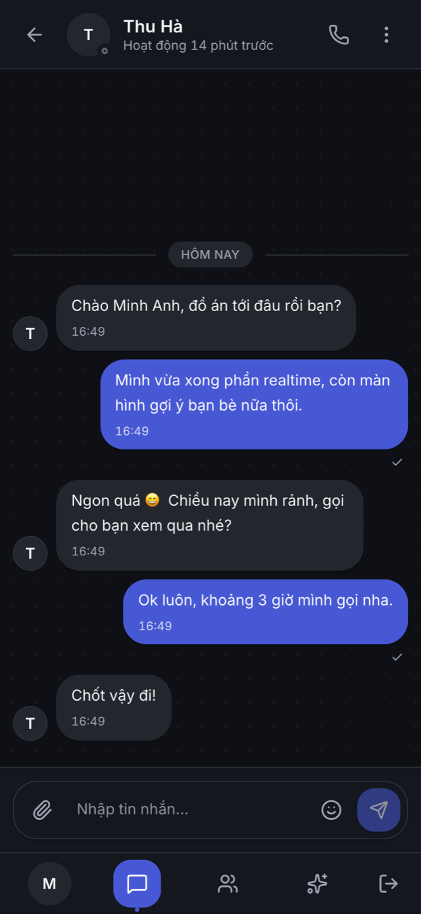
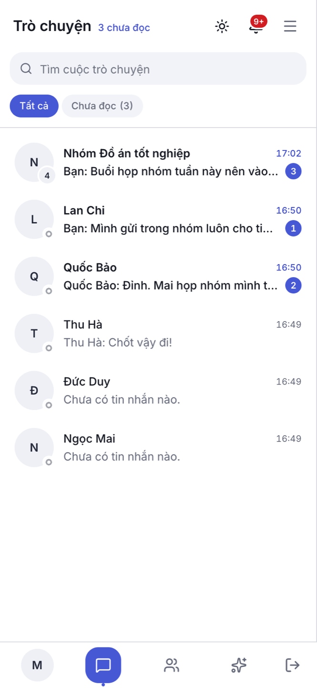

# DALN Chat — Nâng cấp giao diện

Tài liệu này ghi lại đợt làm lại toàn bộ giao diện frontend: hệ màu, các component nền, từng màn hình, và ảnh chụp thực tế của mọi trạng thái.

> README chính của dự án nằm ở [`README.md`](./README.md). File này chỉ nói về phần UI/UX.

Ảnh gốc: [`docs/ui-screenshots/`](./docs/ui-screenshots/) — 64 ảnh (32 màn hình × 2 theme) + 2 bảng tổng hợp.

---

## Mục lục

- [Bối cảnh và định hướng](#bối-cảnh-và-định-hướng)
- [Bảng tổng hợp](#bảng-tổng-hợp)
- [Hệ màu và token](#hệ-màu-và-token)
- [Ba lỗi thật phát hiện khi làm](#ba-lỗi-thật-phát-hiện-khi-làm)
- [Component mới](#component-mới)
- [Toàn bộ màn hình](#toàn-bộ-màn-hình)
- [Bản mobile](#bản-mobile)
- [Cách chụp lại bộ ảnh](#cách-chụp-lại-bộ-ảnh)
- [Kiểm chứng](#kiểm-chứng)
- [Việc chưa làm](#việc-chưa-làm)

---

## Bối cảnh và định hướng

Ứng dụng được phân loại là **Chat & Messaging App**. Định hướng thị giác đi theo:

| Hạng mục | Lựa chọn |
|---|---|
| Style | Minimalism / Swiss + Micro-interactions |
| Màu thương hiệu | Indigo, hue OKLCH **272** (dịch từ violet 285 — vẫn nhận ra là app cũ, bớt cảm giác "AI purple") |
| Cấu trúc palette | Brand primary + tương phản bubble người gửi/người nhận + typing grey + presence green |
| Mật độ | Dense vừa phải (thang spacing 4 → 64px) |
| Chuyển động | Micro-interaction 90–320ms, luôn có nhánh `prefers-reduced-motion` |

Font giữ **Inter** thay vì đổi sang cặp geometric: Inter hiển thị dấu tiếng Việt ổn ở cỡ nhỏ trong UI dày đặc, còn font geometric hay bị chồng dấu.

---

## Bảng tổng hợp

Toàn bộ màn hình trong một ảnh, xem nhanh trước khi đi vào chi tiết.

| Theme tối | Theme sáng |
|---|---|
| [](./docs/ui-screenshots/tong-hop-dark.png) | [](./docs/ui-screenshots/tong-hop-light.png) |

---

## Hệ màu và token

Toàn bộ token nằm trong [`frontend/src/index.css`](./frontend/src/index.css).

Mọi cặp màu **không chọn bằng mắt** — chúng được kiểm bằng script chuyển OKLCH → sRGB → tỉ lệ tương phản WCAG, rồi chỉnh cho tới khi đạt ngưỡng:

| Loại | Ngưỡng | Kết quả |
|---|---|---|
| Chữ thường trên nền | ≥ 4.5:1 | 4.66 – 17.7:1 |
| Chữ phụ (`muted-foreground`) | ≥ 4.5:1 | 5.29:1 (sáng) · 7.61:1 (tối) |
| Chữ trắng trên nút primary | ≥ 4.5:1 | 5.66:1 (cả 2 theme) |
| Viền ô nhập liệu | ≥ 3:1 | 3.06:1 (sáng) · 3.61:1 (tối) |
| Chấm trạng thái online | ≥ 3:1 | 3.36:1 (sáng) · 7.74:1 (tối) |

Một chi tiết đáng lưu ý: **một màu không thể vừa làm nền nút vừa làm chữ trên nền tối**. Muốn chữ trắng trên nút đạt 4.5:1 thì màu phải đủ tối; nhưng chính màu đó dùng làm chữ trên nền tối lại chỉ còn ~3:1. Nên token được tách đôi:

```css
--primary: oklch(0.52 0.19 272);   /* nền nút, chip, bubble gửi đi */
--brand:   oklch(0.48 0.19 272);   /* sáng: chữ/icon thương hiệu */
/* .dark */
--brand:   oklch(0.74 0.15 272);   /* tối: chữ/icon thương hiệu — 8.04:1 */
```

Nhóm token mới được thêm:

```css
/* Chat */
--chat-bg, --bubble-in, --bubble-in-foreground,
--bubble-out, --bubble-out-foreground, --bubble-out-meta, --typing

/* Trạng thái hiện diện */
--presence-online / --presence-away / --presence-busy / --presence-offline

/* Độ nổi (sáng: bóng ngả tím · tối: bóng đen mạnh hơn) */
--shadow-xs / -sm / -md / -lg / -pop

/* Chuyển động */
--motion-instant 90ms · --motion-fast 140ms · --motion-base 200ms · --motion-slow 320ms
--ease-out · --ease-in-out · --ease-spring
```

Các quy tắc đặt ở tầng `base` áp cho toàn app:

- **Một kiểu focus ring duy nhất** — viền 2px + offset 2px, đạt ≥3:1 trên cả nền sáng lẫn tối.
- **Target 44px trên thiết bị cảm ứng** — chỉ áp trong `@media (pointer: coarse)` và chỉ cho các primitive thật sự là target, nên mật độ trên desktop không bị nới ra.
- **`prefers-reduced-motion`** — tắt mọi animation/transition, hiển thị thẳng trạng thái cuối.
- **Chống tràn ngang** — `overflow-wrap: anywhere` cho đoạn văn, URL dài xuống dòng thay vì đẩy layout.

---

## Ba lỗi thật phát hiện khi làm

Không phải vấn đề thẩm mỹ — đây là lỗi chức năng lộ ra khi rà soát UI.

### 1. `ThemeProvider` đặt sai tầng

Provider nằm **bên trong** `MainLayout`, mà `/auth`, `/verify-otp`, `/onboarding/interests`, `/settings/notifications` không dùng layout đó. Hệ quả: các route này không có theme context, class `dark` không bao giờ được gắn, và **nút đổi giao diện ở trang đăng nhập bấm không có tác dụng gì** (`useTheme()` trả về context mặc định rỗng).

Đã đưa provider lên `main.tsx` (trên cả router), thêm script chạy trước lần vẽ đầu tiên trong `index.html` để không bị nháy sáng → tối.

### 2. Toast luôn kẹt ở theme hệ thống

`src/components/ui/sonner.tsx` gọi `useTheme` từ **next-themes** — package có trong `package.json` nhưng provider của nó chưa từng được mount. Thêm nữa, `main.tsx` lại import `Toaster` thẳng từ `sonner`, nên file sonner tuỳ biến (icon, style) **chưa bao giờ được dùng**. Đã sửa cả hai.

### 3. Bubble tin nhắn gửi đi fail tương phản

Bubble dùng `text-text` (= `--foreground`) trên nền `--bg-box-message-out` (= primary). Ở theme sáng thành **chữ gần đen trên nền indigo** — không đọc nổi. Đã đổi sang cặp token chuyên dụng `bubble-out` / `bubble-out-foreground`.

---

## Component mới

| File | Nội dung |
|---|---|
| `ui/badge.tsx` | `Badge` (7 biến thể), `CountBadge` (số chưa đọc, có nhãn cho screen reader), `Chip` (nút thật + `aria-pressed`) |
| `ui/switch.tsx` | Công tắc trên `<button role="switch">` — không thêm dependency Radix |
| `ui/otp-input.tsx` | Ô nhập OTP 6 số: dán được cả mã, điều hướng bằng phím mũi tên, giữ `autocomplete="one-time-code"` |
| `ui/feedback.tsx` | `EmptyState`, `Spinner`, `PageHeader` — dùng chung cho mọi màn hình |
| `Brand/index.tsx` | Logo SVG inline (bong bóng chat kiêm node đồ thị bạn bè) — không dùng emoji, không dùng ảnh raster |
| `AuthForm/PasswordField.tsx` | Ô mật khẩu + nút hiện/ẩn + thanh đo độ mạnh (có cả nhãn chữ, không chỉ dựa vào màu) |

Các primitive sẵn có được làm lại: `button` (thêm `success`/`soft`/`ghost-muted`, phản hồi khi nhấn), `input` (+`Textarea`), `card`, `tabs`, `dialog`, `dropdown-menu`, `tooltip`, `avatar` (+`AvatarWithPresence`, `PresenceDot`), `skeleton` (hiệu ứng quét), `sonner`.

---

## Toàn bộ màn hình

### Luồng đăng nhập

| Màn hình | Tối | Sáng |
|---|---|---|
| Đăng nhập — bố cục 2 cột, panel thương hiệu bên trái | [xem](./docs/ui-screenshots/01-auth-login-dark.png) | [xem](./docs/ui-screenshots/01-auth-login-light.png) |
| Đăng ký + thanh đo độ mạnh mật khẩu | [xem](./docs/ui-screenshots/02-auth-register-strength-dark.png) | [xem](./docs/ui-screenshots/02-auth-register-strength-light.png) |
| Xác thực OTP — 6 ô rời | [xem](./docs/ui-screenshots/03-verify-otp-dark.png) | [xem](./docs/ui-screenshots/03-verify-otp-light.png) |



Tiêu đề trước đây bị kẹp `max-w-[16rem]` khiến chữ "lại" rơi xuống dòng riêng; nay bỏ kẹp và để `text-wrap: balance` tự cân. Nút đổi theme chuyển ra ngoài, thuộc về trang chứ không dính góc thẻ form.

### Trò chuyện

| Màn hình | Tối | Sáng |
|---|---|---|
| Chưa chọn hội thoại | [xem](./docs/ui-screenshots/04-chat-empty-dark.png) | [xem](./docs/ui-screenshots/04-chat-empty-light.png) |
| Chat 1-1 | [xem](./docs/ui-screenshots/10-chat-direct-dark.png) | [xem](./docs/ui-screenshots/10-chat-direct-light.png) |
| Chat nhóm + thẻ bình chọn | [xem](./docs/ui-screenshots/18-chat-group-poll-dark.png) | [xem](./docs/ui-screenshots/18-chat-group-poll-light.png) |
| Sidebar — tìm kiếm | [xem](./docs/ui-screenshots/05-chat-sidebar-search-dark.png) | [xem](./docs/ui-screenshots/05-chat-sidebar-search-light.png) |
| Sidebar — lọc chưa đọc | [xem](./docs/ui-screenshots/06-chat-sidebar-filter-unread-dark.png) | [xem](./docs/ui-screenshots/06-chat-sidebar-filter-unread-light.png) |
| Ô soạn tin nhiều dòng + focus ring | [xem](./docs/ui-screenshots/12-composer-multiline-focus-dark.png) | [xem](./docs/ui-screenshots/12-composer-multiline-focus-light.png) |
| Panel thông tin hội thoại | [xem](./docs/ui-screenshots/16-chat-profile-panel-dark.png) | [xem](./docs/ui-screenshots/16-chat-profile-panel-light.png) |



Những thay đổi đáng kể:

- **Sidebar** có ô tìm kiếm (bỏ dấu tiếng Việt khi so khớp, nên gõ `hoa` vẫn ra `Hoà`), bộ lọc *Tất cả / Chưa đọc*, chấm trạng thái online, thanh dọc đánh dấu mục đang mở (không chỉ dựa vào màu nền), số thành viên trên avatar nhóm.
- **Header** hiện trạng thái thật (`Đang hoạt động` / `Hoạt động 16 phút trước`) thay cho dòng tĩnh "Trò chuyện trực tiếp".
- **Dòng tin nhắn** có vách ngăn theo ngày (`Hôm nay` / `Hôm qua` / thứ trong tuần), tên người gửi **chỉ hiện trong nhóm**, bo góc theo chuỗi tin liên tiếp, giờ hiển thị 24h theo `vi-VN` (trước đây là `en-US` kiểu `3:05 PM`).
- **Ô soạn tin** đổi từ `<input>` một dòng sang textarea tự giãn (tối đa 128px), có ring khi focus vào cả khung, gợi ý phím `Enter` / `Shift + Enter`.
- **Luồng tin ngắn neo xuống đáy** thay vì lơ lửng ở đỉnh khung.

### Bạn bè và gợi ý

| Màn hình | Tối | Sáng |
|---|---|---|
| Danh sách bạn bè | [xem](./docs/ui-screenshots/20-friends-dark.png) | [xem](./docs/ui-screenshots/20-friends-light.png) |
| Nhóm & cộng đồng | [xem](./docs/ui-screenshots/21-groups-dark.png) | [xem](./docs/ui-screenshots/21-groups-light.png) |
| Lời mời kết bạn | [xem](./docs/ui-screenshots/22-friend-requests-dark.png) | [xem](./docs/ui-screenshots/22-friend-requests-light.png) |
| Gợi ý kết bạn | [xem](./docs/ui-screenshots/24-recommendations-dark.png) | [xem](./docs/ui-screenshots/24-recommendations-light.png) |



Màn hình gợi ý giờ **nói rõ vì sao một người được đề xuất**. Các đặc trưng đồ thị vốn đã có sẵn trong response API (`adamic_adar`, `jaccard`, `same_group`, `bio_cosine`, `dist_km`) được quy thành chip đọc được: *Có bạn chung*, *Cùng nhóm*, *Sở thích tương đồng*, *Cách ~3 km*. Danh sách dọc đổi thành lưới thẻ.

### Cài đặt

| Màn hình | Tối | Sáng |
|---|---|---|
| Cài đặt thông báo | [xem](./docs/ui-screenshots/25-notification-settings-dark.png) | [xem](./docs/ui-screenshots/25-notification-settings-light.png) |



Trang này trước đây nằm ngoài `MainLayout` (không có thanh điều hướng, phải bấm "Quay lại chat"), và dùng checkbox cho thứ đáng lẽ là công tắc. Nay đã đưa vào layout chung, đổi sang `Switch`, gom thành 3 nhóm có mô tả, và công tắc tổng làm mờ các mục con khi tắt.

### Dropdown, popover, modal

Phần "những cái nhỏ nhất" — mọi lớp nổi đều được chụp ở trạng thái mở.

| Thành phần | Tối | Sáng |
|---|---|---|
| Dropdown đổi giao diện (có dấu tick mục đang chọn) | [xem](./docs/ui-screenshots/07-dropdown-theme-dark.png) | [xem](./docs/ui-screenshots/07-dropdown-theme-light.png) |
| Popover thông báo | [xem](./docs/ui-screenshots/08-popover-notifications-dark.png) | [xem](./docs/ui-screenshots/08-popover-notifications-light.png) |
| Dropdown menu sidebar | [xem](./docs/ui-screenshots/09-dropdown-sidebar-menu-dark.png) | [xem](./docs/ui-screenshots/09-dropdown-sidebar-menu-light.png) |
| Dropdown thao tác tin nhắn | [xem](./docs/ui-screenshots/11-dropdown-message-actions-dark.png) | [xem](./docs/ui-screenshots/11-dropdown-message-actions-light.png) |
| Bảng chọn emoji | [xem](./docs/ui-screenshots/13-popover-emoji-dark.png) | [xem](./docs/ui-screenshots/13-popover-emoji-light.png) |
| Dropdown tuỳ chọn hội thoại | [xem](./docs/ui-screenshots/14-dropdown-conversation-dark.png) | [xem](./docs/ui-screenshots/14-dropdown-conversation-light.png) |
| Dialog xoá lịch sử | [xem](./docs/ui-screenshots/15-dialog-clear-history-dark.png) | [xem](./docs/ui-screenshots/15-dialog-clear-history-light.png) |
| Modal gọi thoại | [xem](./docs/ui-screenshots/17-modal-voice-call-dark.png) | [xem](./docs/ui-screenshots/17-modal-voice-call-light.png) |
| Dialog tạo bình chọn | [xem](./docs/ui-screenshots/19-dialog-create-poll-dark.png) | [xem](./docs/ui-screenshots/19-dialog-create-poll-light.png) |
| Modal chi tiết lời mời | [xem](./docs/ui-screenshots/23-modal-friend-request-dark.png) | [xem](./docs/ui-screenshots/23-modal-friend-request-light.png) |
| Modal thêm bạn | [xem](./docs/ui-screenshots/26-modal-add-friend-dark.png) | [xem](./docs/ui-screenshots/26-modal-add-friend-light.png) |



Nút mở menu thao tác tin nhắn trước đây **chỉ hiện khi hover** — thiết bị cảm ứng và người dùng bàn phím không với tới được. Nay hiện thêm khi focus, khi menu đang mở, và luôn hiện trên thiết bị không có hover.

---

## Bản mobile

Chụp ở 390×844 (iPhone 14). Thanh điều hướng chuyển xuống đáy và tôn trọng vùng safe area.

| Màn hình | Tối | Sáng |
|---|---|---|
| Danh sách chat | [xem](./docs/ui-screenshots/101-m-chat-list-dark.png) | [xem](./docs/ui-screenshots/101-m-chat-list-light.png) |
| Khung chat | [xem](./docs/ui-screenshots/102-m-chat-thread-dark.png) | [xem](./docs/ui-screenshots/102-m-chat-thread-light.png) |
| Bạn bè | [xem](./docs/ui-screenshots/103-m-friends-dark.png) | [xem](./docs/ui-screenshots/103-m-friends-light.png) |
| Gợi ý kết bạn | [xem](./docs/ui-screenshots/104-m-recommendations-dark.png) | [xem](./docs/ui-screenshots/104-m-recommendations-light.png) |
| Cài đặt thông báo | [xem](./docs/ui-screenshots/105-m-notification-settings-dark.png) | [xem](./docs/ui-screenshots/105-m-notification-settings-light.png) |
| Đăng nhập | [xem](./docs/ui-screenshots/106-m-auth-dark.png) | [xem](./docs/ui-screenshots/106-m-auth-light.png) |

<p align="left">
  
  &nbsp;
  
</p>

---

## Cách chụp lại bộ ảnh

Ảnh chụp từ **app thật đang chạy**, không phải mockup. Muốn tạo lại:

```bash
# 1. Backend (12 service: mongo, redis, rabbitmq, neo4j, qdrant, kong + 6 service Nest)
cd backend && npm run docker:dev

# 2. Frontend — bắt buộc cổng 5173
cd frontend && npm run dev -- --port 5173
```

> **Lưu ý về cổng.** Kong chỉ whitelist `http://localhost:5173` trong `backend/kong/kong.yml`. Chạy vite ở cổng khác thì mọi request đăng nhập sẽ bị chặn bởi CORS mà giao diện không báo lỗi rõ ràng.

Dữ liệu demo được tạo qua REST + socket: 8 tài khoản, hội thoại 1-1 và nhóm, tin nhắn, lời mời kết bạn đang chờ, một bình chọn. Mã OTP đọc thẳng từ Redis (`otp:reg:<email>`) để tự kích hoạt tài khoản mà không cần hộp thư.

Tài khoản demo: `minhanh.demo@daln.test` / `Daln@12345`

Dừng backend:

```bash
cd backend && npm run docker:dev:down
```

---

## Kiểm chứng

| Hạng mục | Kết quả |
|---|---|
| `tsc --noEmit` | Sạch |
| `npm run build` | Thành công (CSS 85.7 kB → 14.8 kB gzip) |
| ESLint | 14 lỗi — **toàn bộ đã tồn tại từ trước**, nằm ở `useWebRTC`, `useCallRingTimeout`, `ProfilePanel` (setState trong effect), `GroupMemberManager` (dùng `any`), `apis/index.ts`. Đợt này không thêm lỗi mới. |
| Tương phản | Kiểm bằng script, số liệu ở [bảng trên](#hệ-màu-và-token) |
| Độ rộng | Chụp thực tế ở 1440px và 390px |

---

## Việc chưa làm

**Hai công tắc giả trong `ProfilePanel`** — "Tắt thông báo cuộc trò chuyện" và "Tin nhắn tự biến mất" vốn không có handler, không có state, bấm không làm gì. Tôi để chúng ở trạng thái `disabled` kèm nhãn *Sắp có* thay vì để trông như bấm được. Phần logic thật thuộc về backend, nằm ngoài phạm vi đợt làm UI này.

**Kích thước bundle** — `index.js` sau build là 1.38 MB (387 kB gzip). Nguyên nhân có từ trước đợt này (three.js, pdfjs, agora, emoji-picker nạp tĩnh). Tách chunk động sẽ giảm đáng kể nhưng là việc riêng, không thuộc phạm vi giao diện.
