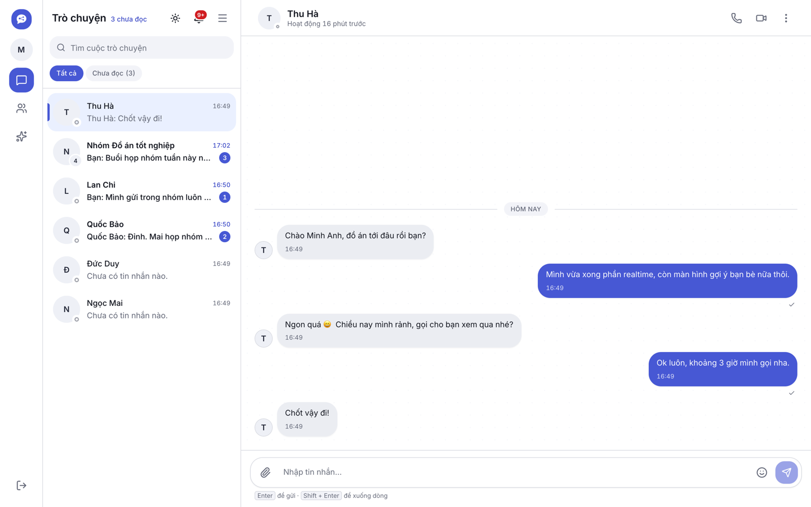
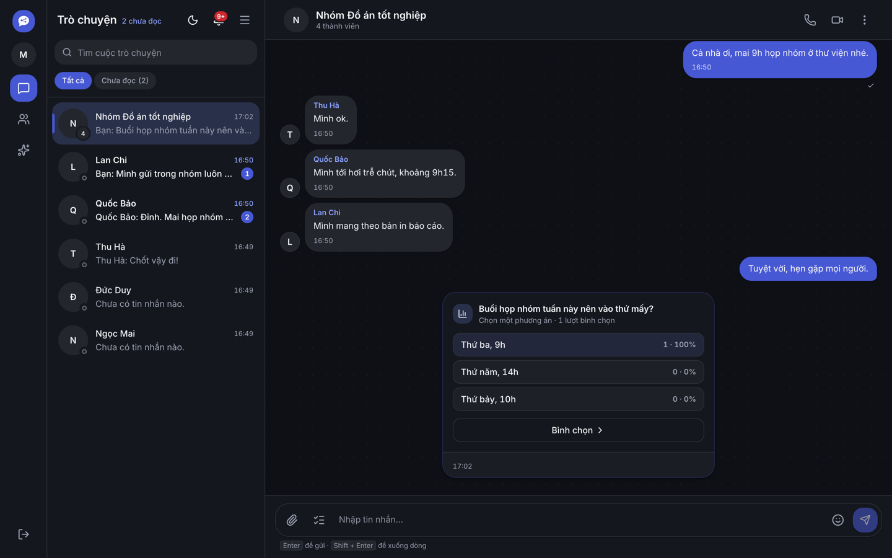
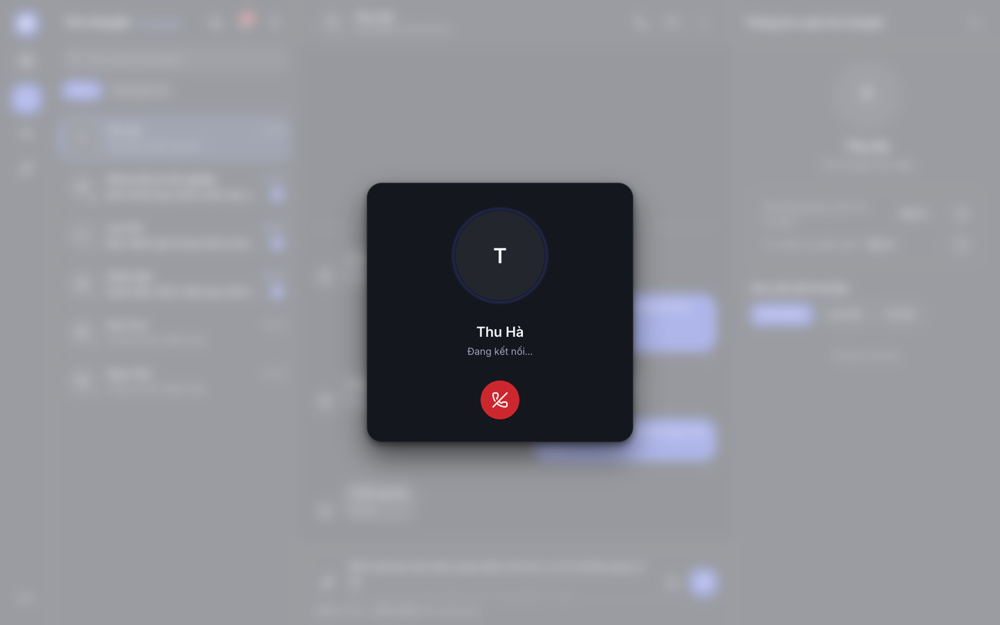
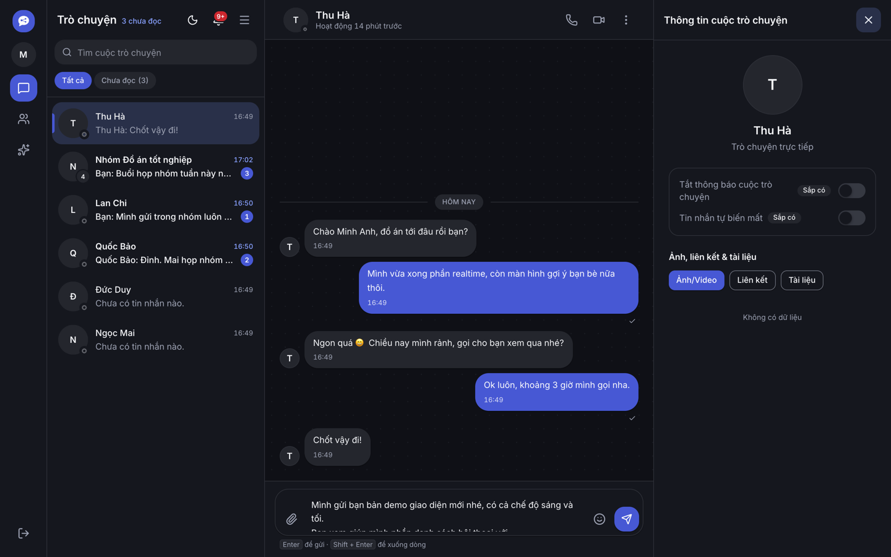
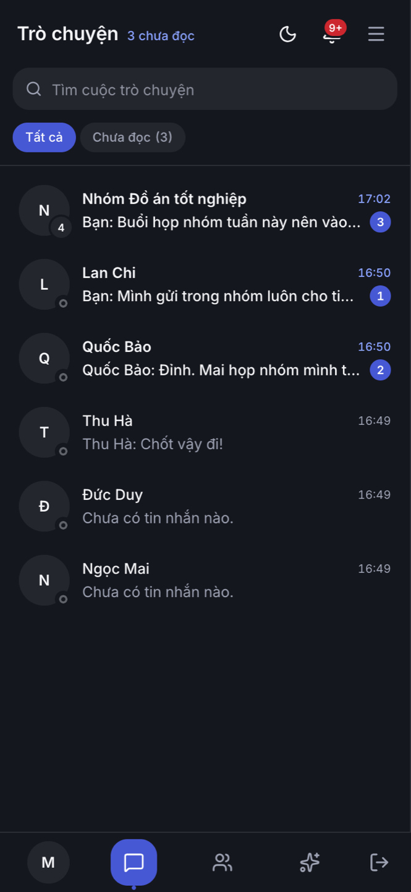
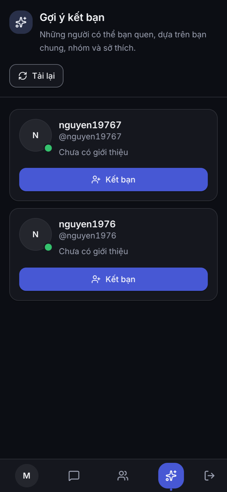
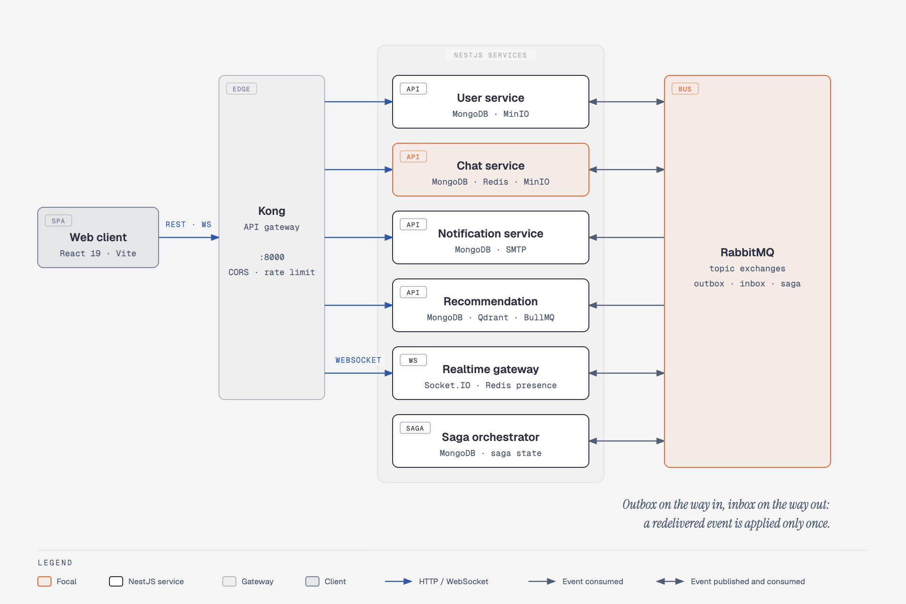
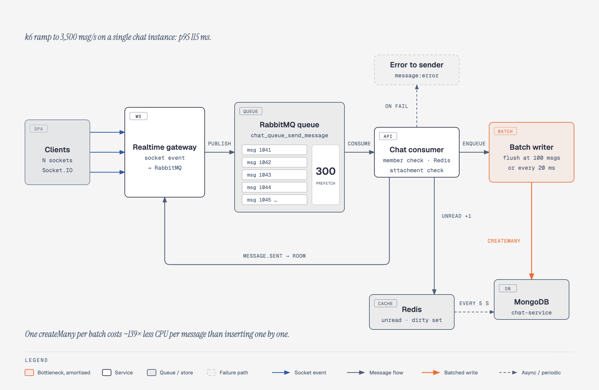
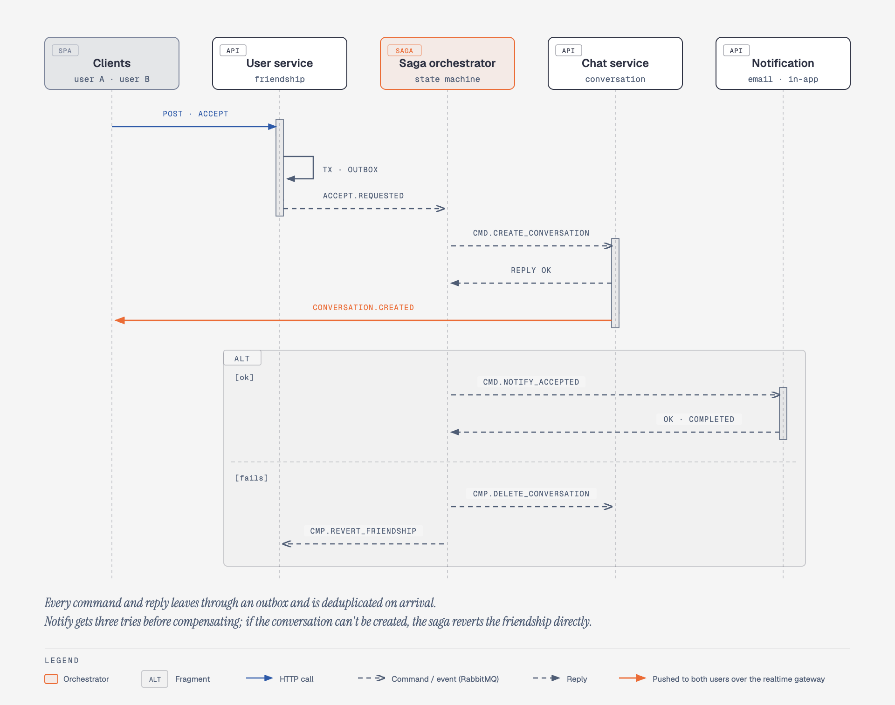
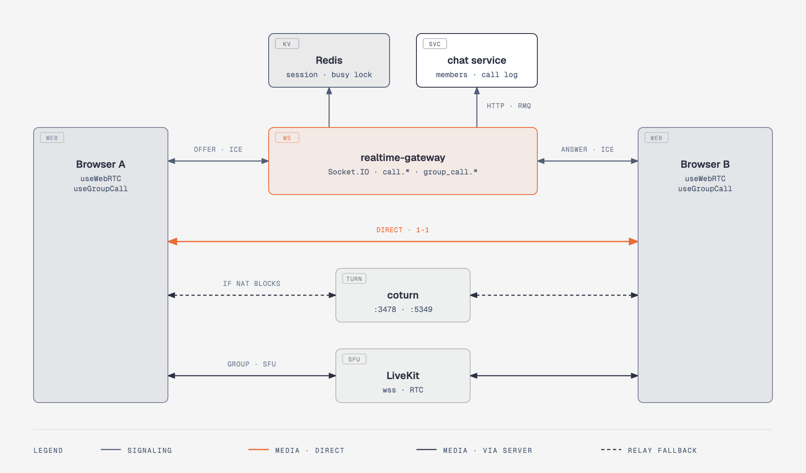

<div align="center">

# DALN Chat

**A real-time messaging platform built as event-driven NestJS microservices.**

1:1 and group chat · voice and video calls · friend suggestions from a trained link-prediction model

[](https://github.com/Nguyen1976/DALN/actions/workflows/ci-cd.yml)       

[**Live demo**](http://109.199.115.126) · [Architecture](#architecture) · [Engineering notes](#engineering-notes) · [Run it locally](#run-it-locally)

</div>

<br>

<picture>
  <source media="(prefers-color-scheme: dark)" srcset="docs/ui-screenshots/10-chat-direct-dark.png">
  
</picture>

## At a glance

| Number | What it is |
|---|---|
| **3,500 msg/s** | sustained by a **single** chat instance in a k6 ramp, at **p95 115 ms** |
| **~139× less CPU** | per stored message, by batching writes into one `createMany` |
| **6 services** | behind one Kong gateway, coordinated over one RabbitMQ bus |
| **0.93 AUC** | Gradient Boosting link-prediction model behind friend suggestions |
| **45 automated checks** | 21 unit tests and 24 end-to-end cases driving two real browsers |
| **75 user stories** | across 15 epics, in [`docs/DALN-User-Stories.xlsx`](docs/DALN-User-Stories.xlsx) |

## Features

**Messaging**
- Direct and group conversations with unread counters, search and an "unread only" filter
- Replies that quote the original message, emoji, multi-line composer
- Image and file attachments uploaded straight to object storage through presigned URLs
- Read receipts, typing indicator, online / offline presence
- Revoke a message for everyone or delete it just for yourself; clear a conversation's history
- Polls inside group chats

**Calls**
- Voice and video calls over WebRTC, with a ringing timeout and a call record left in the conversation

**Social**
- Friend requests, friends list, groups with member management (add, remove, leave)
- Friend suggestions ranked by a trained model, plus an interest onboarding step after sign-up

**Account and notifications**
- Email sign-up with OTP verification and a password strength meter
- In-app notifications with per-channel settings (in-app, email, realtime)
- Light and dark themes, responsive down to phone width

## Screenshots

<table>
  <tr>
    <td width="50%"></td>
    <td width="50%"></td>
  </tr>
  <tr>
    <td align="center"><sub>Group chat with a live poll</sub></td>
    <td align="center"><sub>Voice call over WebRTC</sub></td>
  </tr>
  <tr>
    <td width="50%"></td>
    <td width="50%"></td>
  </tr>
  <tr>
    <td align="center"><sub>Friend suggestions</sub></td>
    <td align="center"><sub>Conversation details panel</sub></td>
  </tr>
</table>

<p align="center">
  
  &nbsp;
  
  &nbsp;
  
</p>

All 32 screens, in light and dark, live in [`docs/ui-screenshots`](docs/ui-screenshots).

## Architecture



- **One way in.** The browser only ever talks to Kong on port 8000: REST for every service and the Socket.IO connection for realtime, with CORS and rate limiting in one place.
- **One bus between services.** Each service owns its MongoDB database and publishes domain events to RabbitMQ topic exchanges; the realtime gateway turns those events into socket pushes.
- **Consistency without distributed transactions.** State changes that other services depend on leave through a transactional outbox, consumers deduplicate through an inbox, and multi-step workflows run as an orchestrated saga.

| Service | Owns | Notes |
|---|---|---|
| `user` | accounts, auth, friendships, profiles | issues JWT cookies; starts the friend-accept saga |
| `chat` | conversations, messages, polls, call records, media | micro-batched writes; presigned uploads to MinIO |
| `notification` | in-app notifications, email | OTP and friend-request emails over SMTP |
| `realtime-gateway` | Socket.IO connections, presence | turns bus events into pushes to rooms |
| `recommendation` | friend suggestions | an API process plus a worker for training and nightly batches |
| `saga-orchestrator` | saga state | coordinates friend-accept, including compensation |

**Infrastructure:** MongoDB 7 (replica set, one database per service, 30 Prisma models) · Redis 7 (presence, membership cache, unread counters, BullMQ) · RabbitMQ 3.13 · Qdrant 1.19 (bio embeddings) · MinIO (S3-compatible media) · Kong 3.7.

## Engineering notes

### 1. 3,500 messages a second on one instance



Before batching, the same chat instance saturated at about 690 msg/s. The fix was to stop paying a database round-trip per message:

- The gateway turns each socket event into a RabbitMQ message; the chat consumer keeps up to **300 in flight** (prefetch).
- Each message goes to a batch writer, and the handler awaits a promise that is **not resolved yet**. The writer flushes when **100 messages** are buffered or **20 ms** have passed, in a single `createMany`, then resolves every waiting handler.
- The RabbitMQ message is acked only after its promise resolves, so a crash mid-batch means redelivery, not loss.
- Ids are generated in the app (`ObjectId`), so the batch insert and the realtime fan-out agree on the id before the row exists.
- Unread counters stay off MongoDB's hot path: a Redis `HINCRBY` plus a dirty set, flushed by a cron every 5 seconds.

Measured with [`testing/test_sendmessage.js`](testing/test_sendmessage.js) (k6 over Socket.IO): a 500 → 2,000 → 3,500 msg/s ramp at p95 115 ms on a clean collection. The script documents its own traps too: the load generator's ceiling, and why test data must be cleared between runs.

### 2. Consistency across services: the friend-accept saga



Accepting a friend request touches three services and there is no distributed transaction, so:

- The user service commits the friendship **and an outbox row in the same MongoDB transaction**; the `OutboxRelay` publishes it. The event exists if, and only if, the write happened.
- The orchestrator persists saga state and issues commands (create conversation, then notify). Each participant replies `OK` or `FAILED`.
- Every consumer runs inside `consumeIdempotent`: the message id goes into an inbox with a unique index, so a redelivered message hits `P2002` and is skipped.
- Failures compensate in reverse: notify is retried three times, then the conversation is deleted and the friendship reverted.

### 3. Audio and video calls: signaling on the socket, media peer to peer



- **1-1 calls are WebRTC peer to peer.** Offer, answer and ICE candidates ride the existing Socket.IO connection, so the gateway relays signaling but never carries audio or video. When NAT blocks the direct path, media goes through coturn with short-lived TURN credentials (`call.ice_config`).
- **The gateway decides who may ring whom.** It asks the chat service whether both users share the 1-1 conversation, takes a per-user busy lock in Redis and stores the session under a `callId`. The first tab to answer wins; the others get `call.claimed` and stop ringing.
- **Group calls go through a LiveKit SFU.** The gateway checks membership, signs a room token and rings the members; LiveKit webhooks report who joined and left.
- **Calls leave a trace.** Rejected and ended 1-1 calls publish `CALL_ENDED` to RabbitMQ, and the chat service writes a call-log message into the conversation.

### 4. Auth that survives expired tokens, on HTTP and WebSocket

- A 15-minute access token and a 7-day refresh token, both in httpOnly cookies.
- One `resolveTokens()` decides for both the HTTP guard and the Socket.IO handshake. HTTP silently re-issues the access cookie; the socket accepts a still-valid refresh token.
- A rejected socket first receives a machine-readable `auth:error` code. The client retries with bounded exponential backoff (at most 5 attempts) instead of going silent until the page is reloaded.
- Covered by [`testing/e2e/socket-auth.spec.js`](testing/e2e/socket-auth.spec.js), which was checked to fail against the previous gateway.

### 5. Friend suggestions from a trained model

Offline, [`training/`](training) builds a link-prediction dataset from the Brightkite social graph in Neo4j and compares five models:

| Model | Test F1 | Test AUC |
|---|---|---|
| Logistic Regression | 0.822 | 0.909 |
| Random Forest | 0.852 | 0.931 |
| **Gradient Boosting** | **0.851** | **0.932** |
| k-Nearest Neighbors | 0.839 | 0.901 |
| C4.5 | 0.848 | 0.930 |

Online, the recommendation service ranks candidates with the exported Gradient Boosting model. Candidates come from friends-of-friends and shared groups in MongoDB, plus bio similarity from multilingual MiniLM embeddings in Qdrant. A separate worker process runs the training queue (BullMQ) and the nightly recompute, so the API stays responsive.

### 6. Shipping: one workflow, one server

- [`ci-cd.yml`](.github/workflows/ci-cd.yml): pull requests to `main` run backend typecheck and unit tests plus frontend lint and build; merging deploys.
- The deploy key can only deploy. An SSH forced command accepts a 40-character SHA that must already be on `main`, takes a lock, resets to it and runs [`deploy/deploy.sh`](deploy/deploy.sh).
- Images are built on the server. A build-time check fails any image whose bundle `require()`s a module that per-service dependency pruning removed, so a broken image never replaces a running container.
- A fresh MongoDB gets its unique indexes from a `db-push` step before any service starts. After every deploy, smoke checks hit each route through Kong.

Details are in [`deploy/README.md`](deploy/README.md).

## Tech stack

| Layer | Tools |
|---|---|
| Frontend | React 19, TypeScript, Vite 7, Redux Toolkit + redux-persist, React Router 7, Tailwind CSS 4, Radix UI, React Hook Form + Zod, Socket.IO client, WebRTC |
| Backend | NestJS 11 monorepo (6 apps), Prisma 6 on MongoDB, `@golevelup/nestjs-rabbitmq`, Socket.IO, ioredis, BullMQ, Nodemailer, AWS SDK v3 (S3 API), prom-client |
| Data | MongoDB 7 replica set, Redis 7, RabbitMQ 3.13, Qdrant 1.19, MinIO |
| ML | Transformers.js (multilingual MiniLM embeddings), Gradient Boosting ranker; Python, scikit-learn, NetworkX and Neo4j for offline training |
| Infra | Kong 3.7, Docker Compose, Nginx, GitHub Actions |
| Testing | Jest, Playwright (two-browser e2e), k6 |

## Run it locally

You need Docker and Node.js 20.19 or newer.

```bash
git clone https://github.com/Nguyen1976/DALN.git
cd DALN/backend
touch .env
docker compose up -d
```

The first `up` builds one dev image shared by all six services, then starts them with hot reload next to MongoDB, Redis, RabbitMQ, Qdrant, MinIO, MailHog and Kong. Dev defaults live in the tracked `.env.docker`; the empty `.env` is only there for your own overrides, such as real SMTP credentials.

```bash
cd ../frontend
npm ci
npm run dev
```

| URL | What |
|---|---|
| http://localhost:5173 | the web app |
| http://localhost:8080 | Kong: API and WebSocket |
| http://localhost:8025 | MailHog, where sign-up OTP emails land |
| http://localhost:9001 | MinIO console (`minioadmin` / `minioadmin`) |
| http://localhost:15672 | RabbitMQ management (`user` / `user`) |

## Tests

**Unit tests**

```bash
cd backend
npm test
```

**End-to-end.** Two real Chrome sessions act as two users: sign-in, friend request, accept, the new conversation appearing on both sides with the right name, and messages flowing both ways. The suite seeds its own accounts and removes them afterwards.

```bash
cd testing
npm ci
npm install --no-save playwright
cd ..
docker cp testing/e2e/seed.js daln-user:/tmp/seed.js
export E2E_SEED="$(docker exec -e NODE_PATH=/app/node_modules daln-user node /tmp/seed.js)"
node testing/e2e/realtime.spec.js
node testing/e2e/socket-auth.spec.js
```

Clean up afterwards:

```bash
docker cp testing/e2e/cleanup.js daln-user:/tmp/cleanup.js
docker exec -e NODE_PATH=/app/node_modules \
  -e CHAT_DATABASE_URL="mongodb://mongo:27017/chat-service?replicaSet=rs0" \
  daln-user node /tmp/cleanup.js
```

**Load test.** `k6 run testing/test_sendmessage.js` runs the 3,500 msg/s ramp. Read the header of [`test_sendmessage.js`](testing/test_sendmessage.js) first: it covers the accounts it expects, other stage plans, and the cleanup step between runs.

## Project structure

```
DALN/
├── backend/                     NestJS monorepo
│   ├── apps/                    user · chat · notification · realtime-gateway · recommendation · saga-orchestrator
│   ├── libs/                    common (auth) · saga (outbox, inbox) · redis · qdrant · storage-s3 · mailer · logger · …
│   ├── kong/kong.yml            gateway routes, CORS, rate limits
│   ├── docker-compose.yml       dev stack: hot reload and local infrastructure
│   └── docker-compose.prod.yml  production stack
├── frontend/                    React SPA, plus the nginx image used in production
├── deploy/                      server-side deploy scripts
├── testing/                     k6 load test, Playwright end-to-end suites
├── training/                    offline link-prediction pipeline (Neo4j, scikit-learn)
└── docs/                        user stories, diagrams, UI screenshots
```

## Documentation

- [`docs/DALN-User-Stories.xlsx`](docs/DALN-User-Stories.xlsx): 75 user stories across 15 epics, with acceptance criteria
- [`docs/diagrams/`](docs/diagrams): the diagrams above, as editable HTML sources and PNG exports
- [`docs/socketio-presence-online-offline.md`](docs/socketio-presence-online-offline.md): how online presence is tracked
- [`training/README.md`](training/README.md): the training pipeline
- [`deploy/README.md`](deploy/README.md): deployment and operations

## Roadmap

- HTTPS on a domain (the demo currently runs over plain HTTP on the server's IP)
- A revocation channel that closes sockets when a session is revoked
- Scheduled MongoDB backups
- Running more than one chat consumer (today a deliberate single instance)

## Author

**Nguyen Ha Nguyen**, Backend Developer

- GitHub: [@Nguyen1976](https://github.com/Nguyen1976)
- Email: nguyenhanguyen25.work@gmail.com

## License

This project is for educational and portfolio purposes.
