# DALN — Sequence Diagrams (62 diagrams)

> Style: v2 — `participant X as Y<br>(detail)`, `activate`/`deactivate`, `alt [condition]`, `rect rgb(255,255,204)`.
> Phương án A: async gộp vào `.async` ngay sau UC chính. Tổng **63 sequence** (62 planned + `CompleteInterestOnboarding.async` tách riêng).
> Nguồn: Codegraph backend + embedding-service Python.

---

## Mục lục

| # | Diagram | Package |
|---|---------|---------|
| 1–9 | Manage Account | §1 |
| 10–15 | Manage Profile | §2 |
| 16–25 | Manage Friendship | §3 |
| 26–36 | Manage Conversation | §4 |
| 37–51 | Manage Message | §5 |
| 52–55 | Manage Notification | §6 |
| 56–58 | Get Recommendations | §7 |
| 59–63 | Realtime Presence | §8 |

---

## §1 Manage Account

### 1. Register

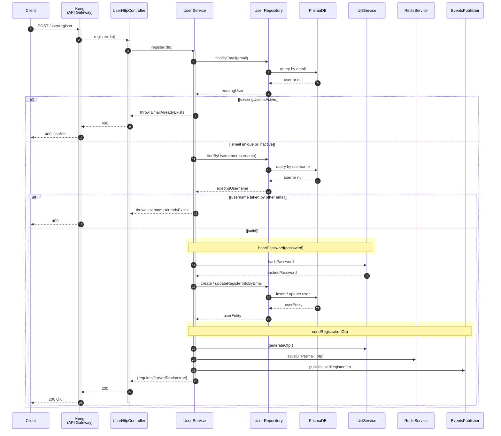

### 2. Register.async — SendOtpEmail

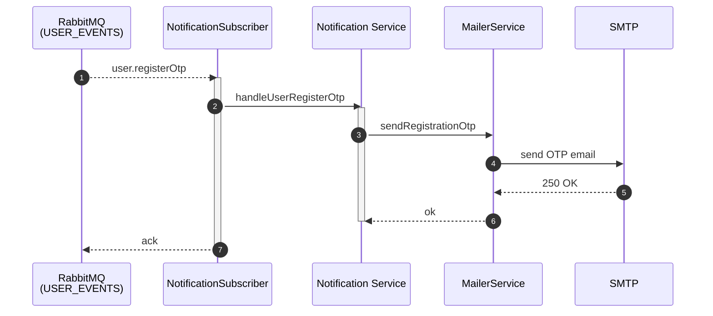

### 3. VerifyOtp

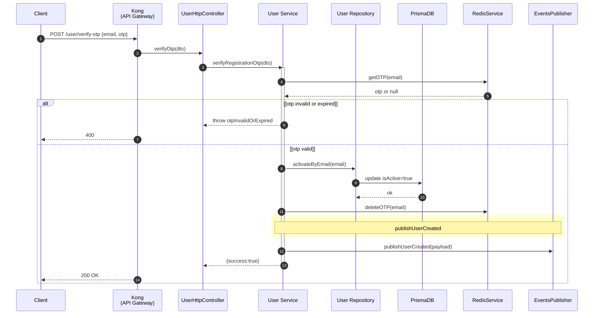

### 4. VerifyOtp.async-1 — SyncUserSnapshot

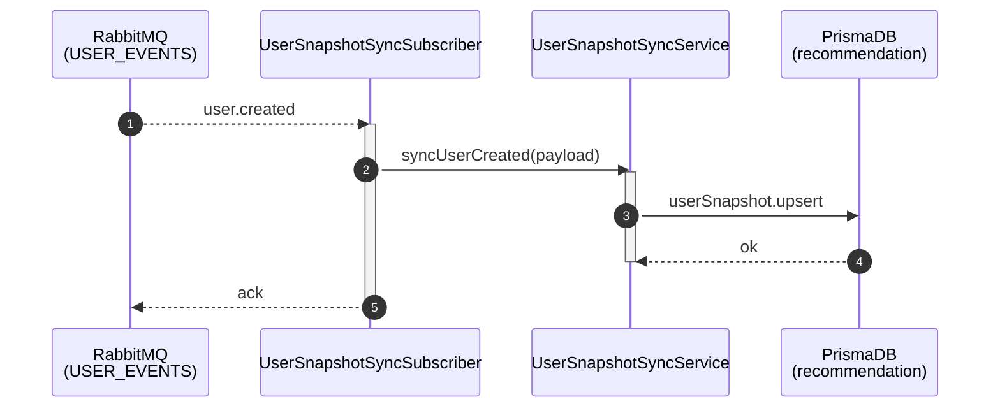

### 5. VerifyOtp.async-2 — SyncNeo4jUserCreated

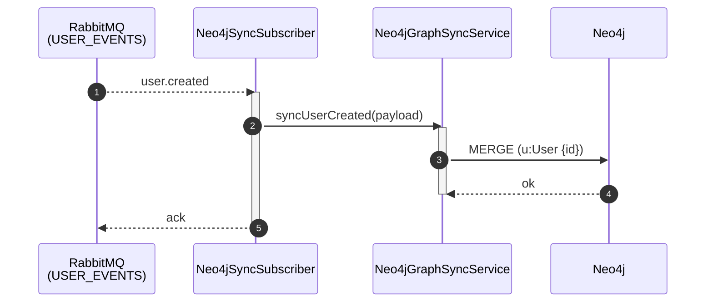

### 6. VerifyOtp.async-3 — SendWelcomeEmail

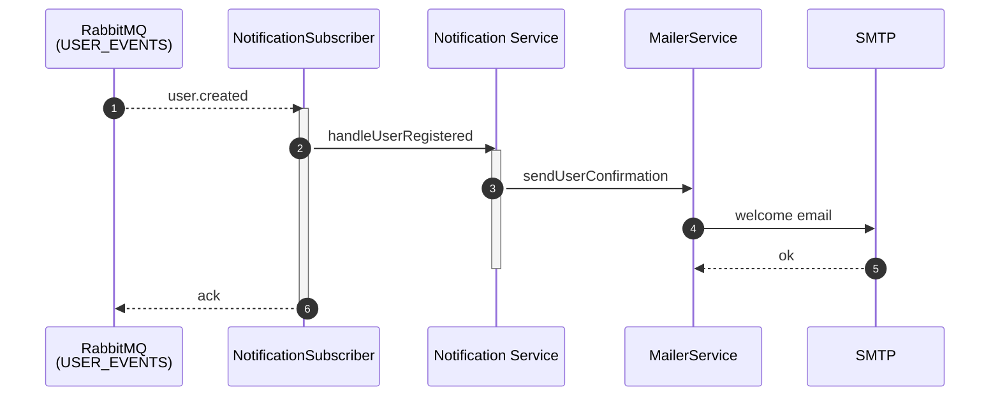

### 7. ResendOtp

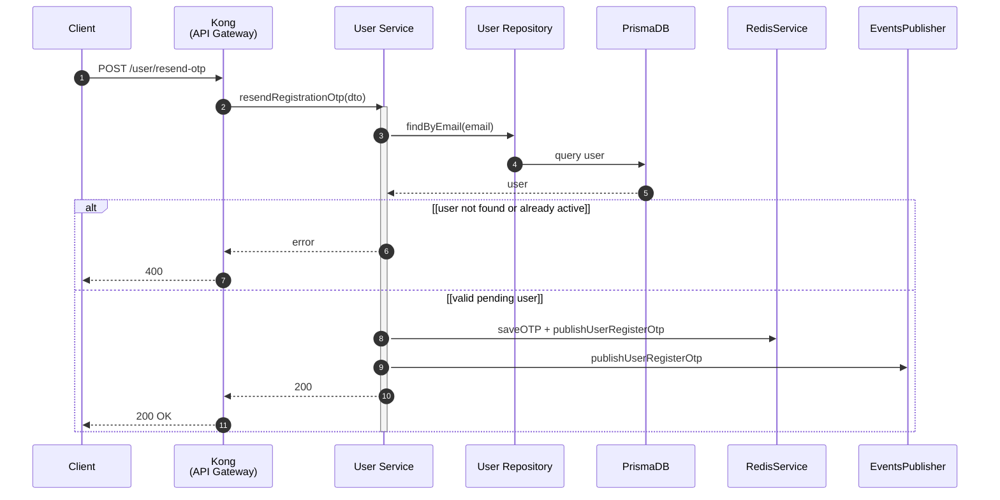

### 8. Login

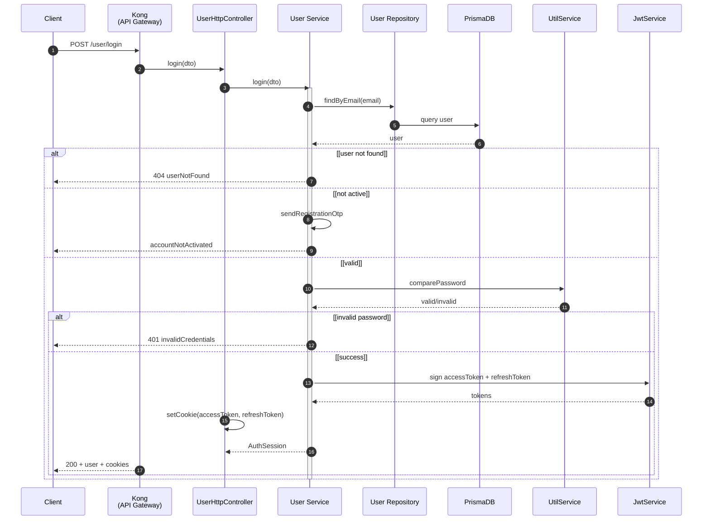

### 9. Logout

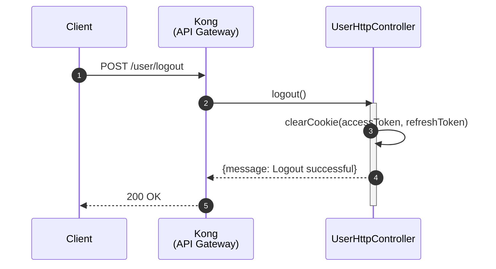

---

## §2 Manage Profile

### 10. ViewProfile

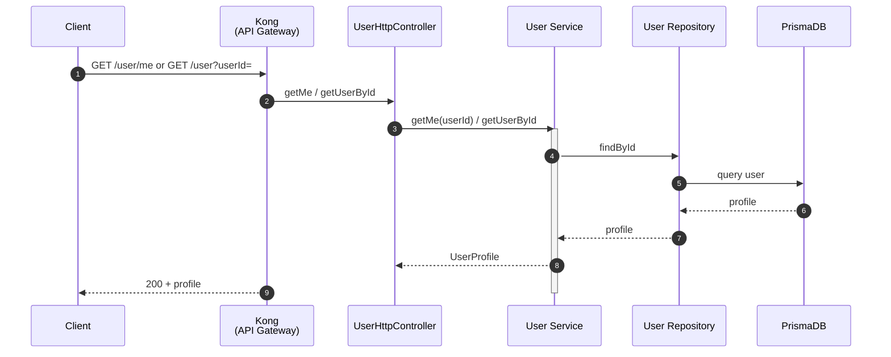

### 11. UpdateProfile

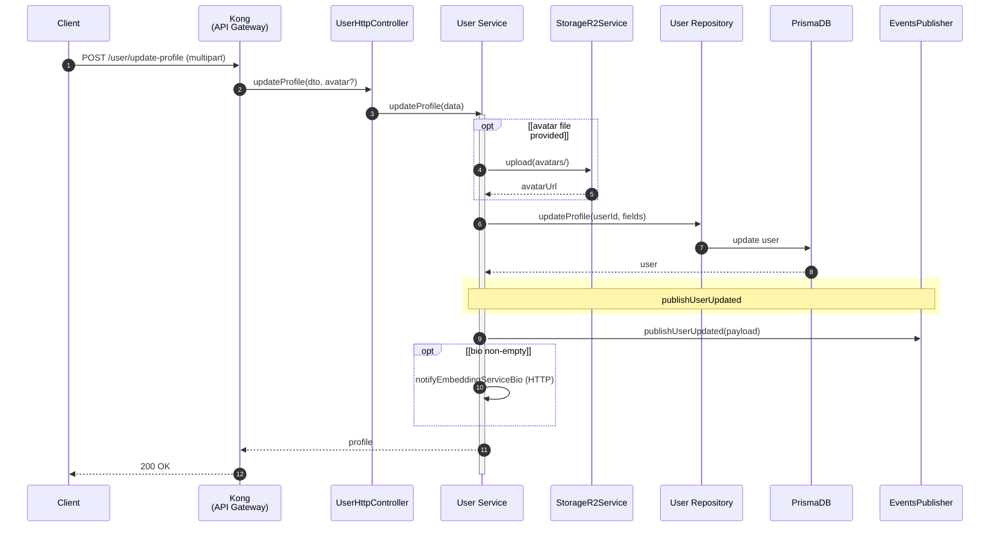

### 12. UpdateProfile.async-1 — EmbedBioToQdrant (Python)

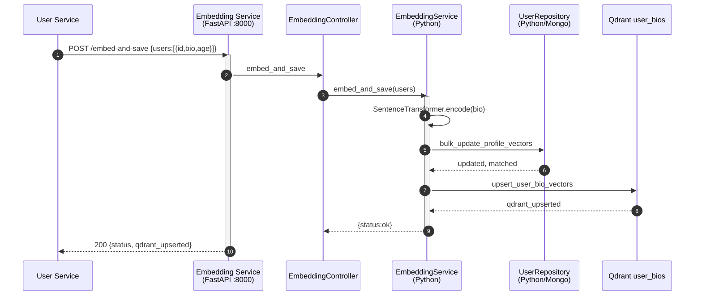

### 13. UpdateProfile.async-2 — SyncSnapshotAndEmbed (RMQ path)

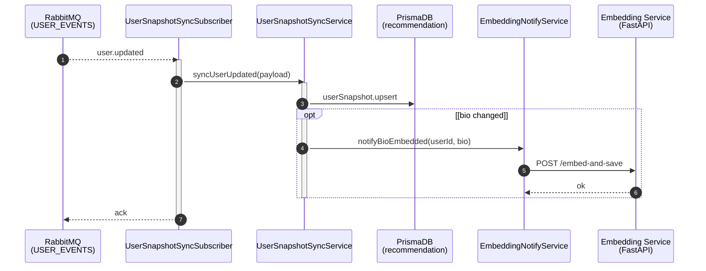

### 14. UpdateProfile.async-3 — UpdateChatMemberDenormalize

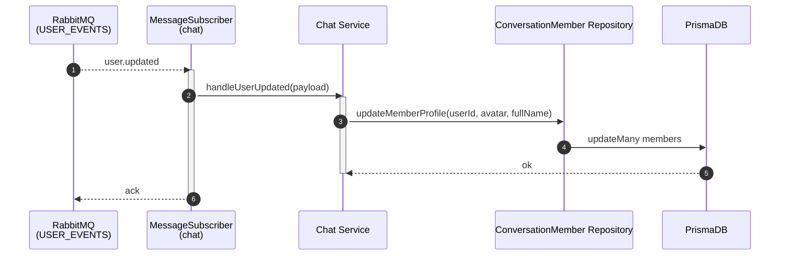

### 15. CompleteInterestOnboarding

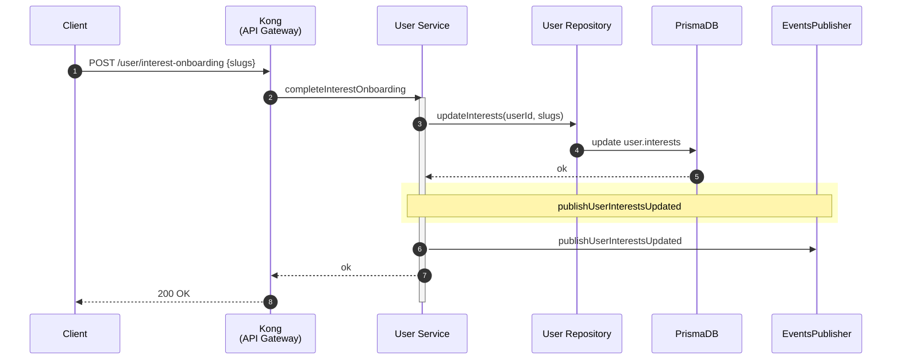

### 15.async — CompleteInterestOnboarding.async — SyncInterestSnapshot

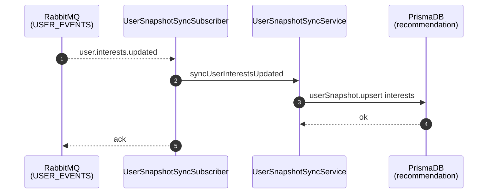

---

## §3 Manage Friendship

### 16. SendFriendRequest

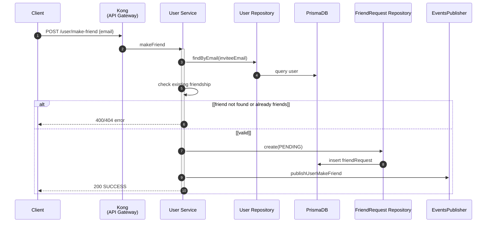

### 17. SendFriendRequest.async — CreateFriendRequestNotification

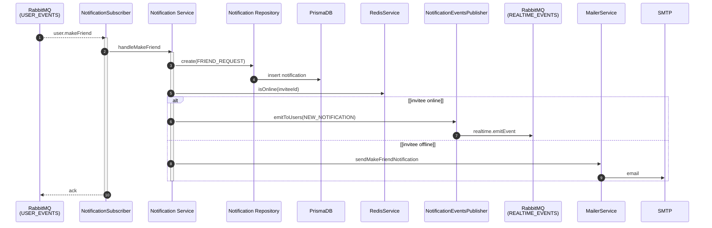

### 18. ListFriendRequests + DetailFriendRequest

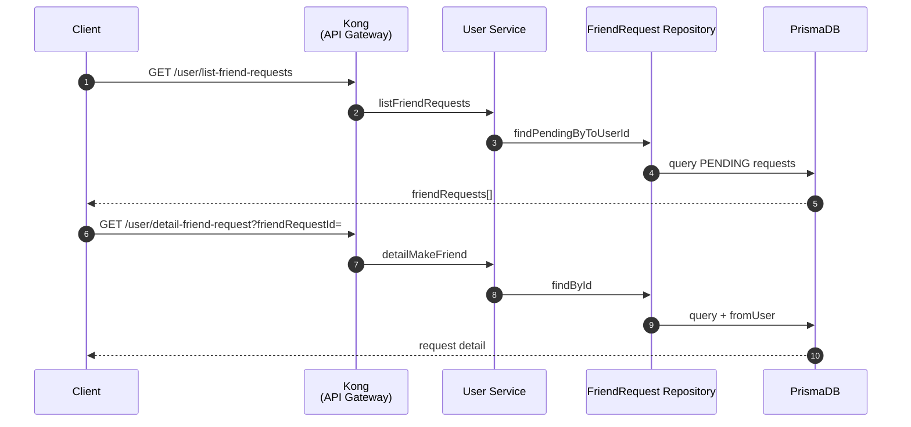

### 19. RespondToFriendRequest

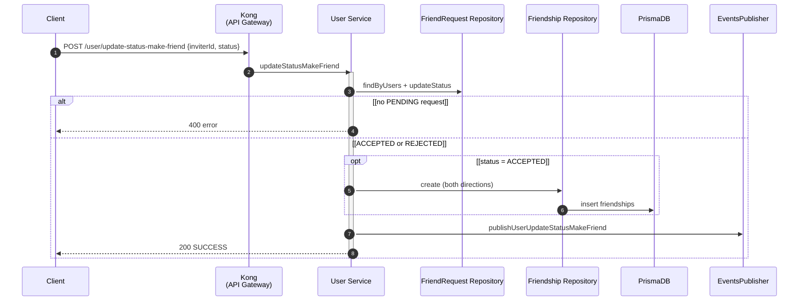

### 20. RespondToFriendRequest.async-1 — CreateDirectConversation

```mermaid
sequenceDiagram
    autonumber
    participant RabbitMQ as RabbitMQ<br>(USER_EVENTS)
    participant ChatSubscriber as MessageSubscriber<br>(chat)
    participant ChatService as Chat Service
    participant ConversationRepository as Conversation Repository
    participant PrismaDB
    participant ChatEventsPublisher

    RabbitMQ-->>ChatSubscriber: user.updateStatusMakeFriend (ACCEPTED)
    activate ChatSubscriber
    ChatSubscriber->>ChatService: createConversationWhenAcceptFriend
    activate ChatService
    ChatService->>ChatService: createConversation(DIRECT, members)
    ChatService->>ConversationRepository: create + createMany members
    ConversationRepository->>PrismaDB: insert conversation
    ChatService->>ChatEventsPublisher: publishConversationCreated
    deactivate ChatService
    ChatSubscriber-->>RabbitMQ: ack
    deactivate ChatSubscriber
```

### 21. RespondToFriendRequest.async-2 — SyncFriendshipNeo4j

```mermaid
sequenceDiagram
    autonumber
    participant RabbitMQ as RabbitMQ<br>(USER_EVENTS)
    participant Neo4jSubscriber as Neo4jSyncSubscriber
    participant Neo4jService as Neo4jGraphSyncService
    participant Neo4jDB as Neo4j

    RabbitMQ-->>Neo4jSubscriber: user.updateStatusMakeFriend (ACCEPTED)
    Neo4jSubscriber->>Neo4jService: syncFriendshipAccepted
    Neo4jService->>Neo4jDB: MERGE bidirectional FRIEND edges
    Neo4jDB-->>Neo4jService: ok
    Neo4jSubscriber-->>RabbitMQ: ack
```

### 22. RespondToFriendRequest.async-3 — StripFromRecommendations

```mermaid
sequenceDiagram
    autonumber
    participant RabbitMQ as RabbitMQ<br>(USER_EVENTS)
    participant RcmSubscriber as FriendshipRecommendationSubscriber
    participant RcmService as RecommendationFriendshipService
    participant PrismaDB as PrismaDB<br>(recommendation)

    RabbitMQ-->>RcmSubscriber: user.updateStatusMakeFriend (ACCEPTED)
    RcmSubscriber->>RcmService: onFriendshipAccepted(userA, userB)
    RcmService->>PrismaDB: remove candidate both directions
    PrismaDB-->>RcmService: ok
    RcmSubscriber-->>RabbitMQ: ack
```

### 23. RespondToFriendRequest.async-4 — NotifyInviter

```mermaid
sequenceDiagram
    autonumber
    participant RabbitMQ as RabbitMQ<br>(USER_EVENTS)
    participant NotificationSubscriber
    participant NotificationService as Notification Service
    participant RedisService
    participant EventsPublisher as NotificationEventsPublisher
    participant RealtimeMQ as RabbitMQ<br>(REALTIME_EVENTS)

    RabbitMQ-->>NotificationSubscriber: user.updateStatusMakeFriend
    NotificationSubscriber->>NotificationService: handleUpdateStatusMakeFriend
    NotificationService->>NotificationService: createNotification (inviterId)
    NotificationService->>RedisService: isOnline(inviterId)
    opt [inviter online]
        NotificationService->>EventsPublisher: emitToUsers(NEW_NOTIFICATION)
        EventsPublisher->>RealtimeMQ: realtime.emitEvent
    end
    NotificationSubscriber-->>RabbitMQ: ack
```

### 24. ListFriends

```mermaid
sequenceDiagram
    autonumber
    participant Client
    participant ApiGateway as Kong<br>(API Gateway)
    participant UserService as User Service
    participant FriendshipRepository as Friendship Repository
    participant PrismaDB
    participant RedisService

    Client->>ApiGateway: GET /user/list-friends
    ApiGateway->>UserService: listFriends(userId, page, limit)
    UserService->>FriendshipRepository: findFriendsByUserId
    FriendshipRepository->>PrismaDB: query friendships + users
    UserService->>RedisService: check online status per friend
    UserService-->>Client: friends[] with status, lastSeen
```

### 25. SearchUsers

```mermaid
sequenceDiagram
    autonumber
    participant Client
    participant ApiGateway as Kong<br>(API Gateway)
    participant UserService as User Service
    participant UserRepository as User Repository
    participant PrismaDB

    Client->>ApiGateway: GET /user/search?keyword=
    ApiGateway->>UserService: searchFriends(userId, keyword)
    UserService->>UserRepository: search by keyword
    UserRepository->>PrismaDB: query users
    PrismaDB-->>Client: friends[]
```

---

## §4 Manage Conversation

### 26. BrowseConversations

```mermaid
sequenceDiagram
    autonumber
    participant Client
    participant ApiGateway as Kong<br>(API Gateway)
    participant ChatController as ChatHttpController
    participant ChatService as Chat Service
    participant ConversationRepository as Conversation Repository
    participant PrismaDB

    Client->>ApiGateway: GET /chat/conversations
    ApiGateway->>ChatController: getConversations
    ChatController->>ChatService: getConversations(userId, cursor)
    ChatService->>ConversationRepository: findByUserId
    ConversationRepository->>PrismaDB: query + lastMessage
    PrismaDB-->>Client: conversations[]

    Note over Client,PrismaDB: Also: GET /chat/search, GET /chat/conversation-by-friend
```

### 27. ViewConversation + JoinRoom

```mermaid
sequenceDiagram
    autonumber
    participant Client
    participant ApiGateway as Kong<br>(API Gateway)
    participant ChatService as Chat Service
    participant PrismaDB
    participant RealtimeGateway as Realtime Gateway

    Client->>ApiGateway: GET /chat/conversations/:id
    ApiGateway->>ChatService: getConversationById
    ChatService->>PrismaDB: query conversation + members
    PrismaDB-->>Client: conversation detail

    Client->>RealtimeGateway: WS conversation:join {conversationId}
    RealtimeGateway->>RealtimeGateway: client.join(conversation:convId)
    RealtimeGateway-->>Client: joined room
```

### 28. CreateConversation (Group)

```mermaid
sequenceDiagram
    autonumber
    participant Client
    participant ApiGateway as Kong<br>(API Gateway)
    participant ChatController as ChatHttpController
    participant ChatService as Chat Service
    participant StorageR2Service
    participant ConversationRepository as Conversation Repository
    participant PrismaDB
    participant ChatEventsPublisher

    Client->>ApiGateway: POST /chat/create (GROUP, members, groupAvatar?)
    ApiGateway->>ChatController: createConversation
    ChatController->>ChatService: createConversation
    activate ChatService

    opt [groupAvatar]
        ChatService->>StorageR2Service: upload avatars/
    end

    ChatService->>ConversationRepository: create + createMany members
    ConversationRepository->>PrismaDB: insert conversation
    ChatService->>ChatEventsPublisher: publishConversationCreated
    ChatService->>ChatEventsPublisher: publishUserJoinedGroup (each member)
    ChatService-->>Client: conversation
    deactivate ChatService
```

### 29. CreateConversation.async — FanOutNewConversation

```mermaid
sequenceDiagram
    autonumber
    participant ChatEventsPublisher
    participant RabbitMQ as RabbitMQ<br>(REALTIME + USER_EVENTS)
    participant RealtimeGateway as Realtime Gateway
    participant RcmSubscriber as GroupMembershipSubscriber
    participant Client as Online Members

    ChatEventsPublisher->>RabbitMQ: realtime.emitEvent (NEW_CONVERSATION)
    RabbitMQ-->>RealtimeGateway: deliver
    RealtimeGateway->>Client: WS chat.new_conversation

    ChatEventsPublisher->>RabbitMQ: user.joinedGroup (per member)
    RabbitMQ-->>RcmSubscriber: deliver
    RcmSubscriber->>RcmSubscriber: onUserJoinedGroup (RCM sync)
```

### 30. AddMemberToConversation

```mermaid
sequenceDiagram
    autonumber
    participant Client
    participant ApiGateway as Kong<br>(API Gateway)
    participant ChatService as Chat Service
    participant MemberRepository as ConversationMember Repository
    participant PrismaDB
    participant ChatEventsPublisher

    Client->>ApiGateway: POST /chat/add-member
    ApiGateway->>ChatService: addMemberToConversation
    ChatService->>MemberRepository: createMany(newMembers)
    MemberRepository->>PrismaDB: insert members
    ChatService->>ChatEventsPublisher: publishMemberAdded + publishUserJoinedGroup
    ChatService-->>Client: updated conversation
```

### 31. AddMember.async — JoinedGroupSyncRcm

```mermaid
sequenceDiagram
    autonumber
    participant RabbitMQ as RabbitMQ<br>(USER_EVENTS)
    participant RcmSubscriber as GroupMembershipSubscriber
    participant RcmService as RecommendationGroupMembershipService
    participant PrismaDB as PrismaDB<br>(recommendation)

    RabbitMQ-->>RcmSubscriber: user.joinedGroup
    RcmSubscriber->>RcmService: onUserJoinedGroup
    RcmService->>PrismaDB: update group membership features
    RcmSubscriber-->>RabbitMQ: ack
```

### 32. RemoveMemberFromConversation

```mermaid
sequenceDiagram
    autonumber
    participant Client
    participant ApiGateway as Kong<br>(API Gateway)
    participant ChatService as Chat Service
    participant MemberRepository as ConversationMember Repository
    participant PrismaDB
    participant ChatEventsPublisher

    Client->>ApiGateway: POST /chat/remove-member
    ApiGateway->>ChatService: removeMemberFromConversation
    ChatService->>MemberRepository: remove member
    MemberRepository->>PrismaDB: delete member
    ChatService->>ChatEventsPublisher: publishUserLeftGroup + member_removed event
    ChatService-->>Client: ok
```

### 33. LeaveConversation

```mermaid
sequenceDiagram
    autonumber
    participant Client
    participant ApiGateway as Kong<br>(API Gateway)
    participant ChatService as Chat Service
    participant MemberRepository as ConversationMember Repository
    participant PrismaDB
    participant ChatEventsPublisher

    Client->>ApiGateway: POST /chat/leave-group
    ApiGateway->>ChatService: leaveConversation
    ChatService->>MemberRepository: remove self
    MemberRepository->>PrismaDB: delete member
    ChatService->>ChatEventsPublisher: publishUserLeftGroup
    ChatService-->>Client: ok
```

### 34. LeftGroup.async — LeftGroupSyncRcm

```mermaid
sequenceDiagram
    autonumber
    participant RabbitMQ as RabbitMQ<br>(USER_EVENTS)
    participant RcmSubscriber as GroupMembershipSubscriber
    participant RcmService as RecommendationGroupMembershipService
    participant PrismaDB as PrismaDB<br>(recommendation)

    RabbitMQ-->>RcmSubscriber: user.leftGroup
    RcmSubscriber->>RcmService: onUserLeftGroup
    RcmService->>PrismaDB: update group features
    RcmSubscriber-->>RabbitMQ: ack
```

### 35. DeleteConversation

```mermaid
sequenceDiagram
    autonumber
    participant Client
    participant ApiGateway as Kong<br>(API Gateway)
    participant ChatService as Chat Service
    participant ConversationRepository as Conversation Repository
    participant PrismaDB

    Client->>ApiGateway: POST /chat/delete-conversation
    ApiGateway->>ChatService: deleteConversation
    ChatService->>ConversationRepository: soft delete / remove
    ConversationRepository->>PrismaDB: update/delete
    ChatService-->>Client: ok
```

### 36. ViewConversationAssets

```mermaid
sequenceDiagram
    autonumber
    participant Client
    participant ApiGateway as Kong<br>(API Gateway)
    participant ChatService as Chat Service
    participant MessageRepository as Message Repository
    participant PrismaDB

    Client->>ApiGateway: GET /chat/assets?conversationId=&kind=
    ApiGateway->>ChatService: getConversationAssets
    ChatService->>MessageRepository: findMediaByConversation
    MessageRepository->>PrismaDB: query messageMedia
    PrismaDB-->>Client: assets[]
```

---

## §5 Manage Message

### 37. ViewMessages

```mermaid
sequenceDiagram
    autonumber
    participant Client
    participant ApiGateway as Kong<br>(API Gateway)
    participant ChatController as ChatHttpController
    participant ChatService as Chat Service
    participant MessageRepository as Message Repository
    participant PrismaDB

    Client->>ApiGateway: GET /chat/messages/:conversationId
    ApiGateway->>ChatController: getMessagesByConversationId
    ChatController->>ChatService: getMessages(convId, cursor)
    ChatService->>MessageRepository: findByConversationId
    MessageRepository->>PrismaDB: query messages + medias + polls
    PrismaDB-->>Client: messages[]
```

### 38. SendMessage

```mermaid
sequenceDiagram
    autonumber
    participant Client
    participant RealtimeGateway as Realtime Gateway<br>(Socket.IO)
    participant RabbitMQ as RabbitMQ<br>(REALTIME_EVENTS)
    participant MessageSubscriber as MessageSubscriber<br>(chat)
    participant ChatService as Chat Service
    participant ConvMemberRepository as ConversationMember Repository
    participant MessageRepository as Message Repository
    participant PrismaDB
    participant UnreadQueue as BullMQ unreadQueue
    participant ChatEventsPublisher

    Client->>RealtimeGateway: WS message:create
    activate RealtimeGateway
    RealtimeGateway->>RabbitMQ: publish realtime.sendMessage
    deactivate RealtimeGateway

    RabbitMQ-->>MessageSubscriber: deliver
    activate MessageSubscriber
    MessageSubscriber->>ChatService: sendMessage(payload)
    activate ChatService

    ChatService->>ConvMemberRepository: findByConversationId
    ConvMemberRepository->>PrismaDB: query members
    PrismaDB-->>ChatService: members[]

    alt [sender not member]
        ChatService->>ChatEventsPublisher: publishMessageError
    else [valid]
        ChatService->>MessageRepository: create(message)
        MessageRepository->>PrismaDB: insert message
        rect rgb(255, 255, 204)
            Note over ChatService, UnreadQueue: enqueue increase-unread
        end
        ChatService->>UnreadQueue: add('increase-unread', job)
        ChatService->>ChatEventsPublisher: publishMessageSent (ACK + NEW)
        ChatEventsPublisher->>RabbitMQ: realtime.emitEvent x2
    end
    deactivate ChatService
    MessageSubscriber-->>RabbitMQ: ack
    deactivate MessageSubscriber
```

### 39. SendMessage.async-1 — UpdateUnreadCounter

```mermaid
sequenceDiagram
    autonumber
    participant Redis as Redis<br>(BullMQ)
    participant UnreadQueue as BullMQ unreadQueue
    participant UnreadProcessor as UnreadProcessor
    participant ConvMemberRepository as ConversationMember Repository
    participant ConversationRepository as Conversation Repository
    participant PrismaDB
    participant ChatEventsPublisher
    participant RabbitMQ as RabbitMQ<br>(REALTIME_EVENTS)

    Redis-->>UnreadQueue: job ready
    UnreadQueue->>UnreadProcessor: process(job)
    activate UnreadProcessor
    UnreadProcessor->>ConvMemberRepository: incrementUnreadForOthers
    ConvMemberRepository->>PrismaDB: $inc unreadCount
    UnreadProcessor->>ConversationRepository: updateLastMessage
    ConversationRepository->>PrismaDB: $set lastMessage*
    UnreadProcessor->>ChatEventsPublisher: publishConversationUpdate
    ChatEventsPublisher->>RabbitMQ: realtime.emitEvent
    UnreadProcessor-->>UnreadQueue: complete
    deactivate UnreadProcessor
```

### 40. SendMessage.async-2 — FanOutSocketEvent

```mermaid
sequenceDiagram
    autonumber
    participant RabbitMQ as RabbitMQ<br>(REALTIME_EVENTS)
    participant RealtimeGateway as Realtime Gateway
    participant RedisAdapter as Redis Adapter
    participant SocketIOServer as Socket.IO Server
    participant Recipients as Online Recipients

    RabbitMQ-->>RealtimeGateway: deliver realtime.emitEvent
    activate RealtimeGateway
    loop each userId in payload.userIds
        RealtimeGateway->>SocketIOServer: server.to(user:id).emit(event, data)
        SocketIOServer->>RedisAdapter: cluster pub
        SocketIOServer-->>Recipients: WS frame
    end
    RealtimeGateway-->>RabbitMQ: ack
    deactivate RealtimeGateway
```

### 41. RequestMediaUploadUrl

```mermaid
sequenceDiagram
    autonumber
    participant Client
    participant ApiGateway as Kong<br>(API Gateway)
    participant ChatService as Chat Service
    participant MemberRepository as ConversationMember Repository
    participant StorageR2Service
    participant PrismaDB

    Client->>ApiGateway: POST /chat/media/presign
    ApiGateway->>ChatService: createMessageUploadUrl
    ChatService->>MemberRepository: verify membership
    MemberRepository->>PrismaDB: query member
    ChatService->>StorageR2Service: createPresignedUploadUrl
    StorageR2Service-->>Client: {uploadUrl, objectKey}
```

### 42. SendMessageWithMedia

```mermaid
sequenceDiagram
    autonumber
    participant Client
    participant ApiGateway as Kong<br>(API Gateway)
    participant StorageR2 as Cloudflare R2
    participant RealtimeGateway as Realtime Gateway
    participant RabbitMQ as RabbitMQ<br>(REALTIME_EVENTS)
    participant ChatService as Chat Service
    participant PrismaDB

    Client->>ApiGateway: POST /chat/media/presign
    ApiGateway-->>Client: uploadUrl + objectKey
    Client->>StorageR2: PUT file (presigned)
    StorageR2-->>Client: 200

    Client->>RealtimeGateway: WS message:create (type=IMAGE, medias[])
    RealtimeGateway->>RabbitMQ: realtime.sendMessage
    RabbitMQ-->>ChatService: sendMessage
    ChatService->>ChatService: validateMime + checkObjectExists(R2)
    ChatService->>PrismaDB: insert message + messageMedia
    Note over ChatService,Client: Then: UpdateUnreadCounter + FanOutSocketEvent (§39–40)
```

### 43. RevokeMessage

```mermaid
sequenceDiagram
    autonumber
    participant Client
    participant ApiGateway as Kong<br>(API Gateway)
    participant ChatService as Chat Service
    participant MessageRepository as Message Repository
    participant PrismaDB
    participant ChatEventsPublisher
    participant RabbitMQ as RabbitMQ<br>(REALTIME_EVENTS)

    Client->>ApiGateway: POST /chat/messages/revoke
    ApiGateway->>ChatService: revokeMessage
    ChatService->>MessageRepository: markRevoked
    MessageRepository->>PrismaDB: update message
    ChatService->>ChatEventsPublisher: publishMessageRevoked
    ChatEventsPublisher->>RabbitMQ: realtime.emitEvent
    Note over RabbitMQ,Client: FanOutSocketEvent → all members
```

### 44. DeleteMessageForMe

```mermaid
sequenceDiagram
    autonumber
    participant Client
    participant ApiGateway as Kong<br>(API Gateway)
    participant ChatService as Chat Service
    participant MessageRepository as Message Repository
    participant PrismaDB

    Client->>ApiGateway: POST /chat/messages/delete-for-me
    ApiGateway->>ChatService: deleteMessageForMe
    ChatService->>MessageRepository: insert DeleteMessage record
    MessageRepository->>PrismaDB: hide for userId
    ChatService-->>Client: ok
```

### 45. ClearConversationHistory

```mermaid
sequenceDiagram
    autonumber
    participant Client
    participant ApiGateway as Kong<br>(API Gateway)
    participant ChatService as Chat Service
    participant MessageRepository as Message Repository
    participant PrismaDB

    Client->>ApiGateway: POST /chat/conversations/clear-history
    ApiGateway->>ChatService: clearConversationHistory
    ChatService->>MessageRepository: clearForUser or deleteAll
    MessageRepository->>PrismaDB: update/delete messages
    ChatService-->>Client: ok
```

### 46. IndicateTyping

```mermaid
sequenceDiagram
    autonumber
    participant Client
    participant RealtimeGateway as Realtime Gateway
    participant RabbitMQ as RabbitMQ<br>(REALTIME_EVENTS)
    participant Recipients as Conversation Members

    Client->>RealtimeGateway: WS user:typing {convId, status:start|stop}
    RealtimeGateway->>RabbitMQ: publish realtime.emitEvent
    RabbitMQ-->>RealtimeGateway: FanOut to conversation room
    RealtimeGateway-->>Recipients: WS user:typing
```

### 47. MarkAsRead

```mermaid
sequenceDiagram
    autonumber
    participant Client
    participant RealtimeGateway as Realtime Gateway
    participant RabbitMQ as RabbitMQ<br>(REALTIME_EVENTS)
    participant Recipients as Conversation Members

    Client->>RealtimeGateway: WS message:read {convId, lastMessageId}
    RealtimeGateway->>RealtimeGateway: queueReadBroadcast (batch)
    RealtimeGateway->>RabbitMQ: publish message.updateRead
    RealtimeGateway-->>Recipients: WS user:read (batched)
```

### 48. MarkAsRead.async — UpdateMessageReadState

```mermaid
sequenceDiagram
    autonumber
    participant RabbitMQ as RabbitMQ<br>(REALTIME_EVENTS)
    participant ChatSubscriber as MessageSubscriber<br>(chat)
    participant ChatService as Chat Service
    participant MemberRepository as ConversationMember Repository
    participant PrismaDB

    RabbitMQ-->>ChatSubscriber: message.updateRead
    activate ChatSubscriber
    ChatSubscriber->>ChatService: updateMessageRead(payload)
    ChatService->>MemberRepository: updateLastReadAt
    MemberRepository->>PrismaDB: update member.lastReadAt
    ChatSubscriber-->>RabbitMQ: ack
    deactivate ChatSubscriber
```

### 49. CreatePoll

```mermaid
sequenceDiagram
    autonumber
    participant Client
    participant ApiGateway as Kong<br>(API Gateway)
    participant ChatService as Chat Service
    participant PollRepository as Poll Repository
    participant MessageRepository as Message Repository
    participant PrismaDB
    participant ChatEventsPublisher
    participant RabbitMQ as RabbitMQ<br>(REALTIME_EVENTS)

    Client->>ApiGateway: POST /chat/polls
    ApiGateway->>ChatService: createPoll
    ChatService->>PollRepository: create poll + options
    ChatService->>MessageRepository: create POLL message
    PollRepository->>PrismaDB: insert
    ChatService->>ChatEventsPublisher: publishMessageSent + publishPollUpdated
    ChatEventsPublisher->>RabbitMQ: realtime.emitEvent
    ChatService-->>Client: poll message
```

### 50. VotePoll

```mermaid
sequenceDiagram
    autonumber
    participant Client
    participant ApiGateway as Kong<br>(API Gateway)
    participant ChatService as Chat Service
    participant PollRepository as Poll Repository
    participant PrismaDB
    participant ChatEventsPublisher
    participant RabbitMQ as RabbitMQ<br>(REALTIME_EVENTS)

    Client->>ApiGateway: POST /chat/polls/vote
    ApiGateway->>ChatService: submitPollVote
    ChatService->>PollRepository: upsert vote + increment count
    PollRepository->>PrismaDB: update
    ChatService->>ChatEventsPublisher: publishPollUpdated
    ChatEventsPublisher->>RabbitMQ: realtime.emitEvent
    ChatService-->>Client: updated poll
```

### 51. ClosePoll

```mermaid
sequenceDiagram
    autonumber
    participant Client
    participant ApiGateway as Kong<br>(API Gateway)
    participant ChatService as Chat Service
    participant PollRepository as Poll Repository
    participant PrismaDB
    participant ChatEventsPublisher
    participant RabbitMQ as RabbitMQ<br>(REALTIME_EVENTS)

    Client->>ApiGateway: POST /chat/polls/close
    ApiGateway->>ChatService: closePoll
    ChatService->>PollRepository: set isClosed=true
    PollRepository->>PrismaDB: update
    ChatService->>ChatEventsPublisher: publishPollClosed
    ChatEventsPublisher->>RabbitMQ: realtime.emitEvent
    ChatService-->>Client: closed poll
```

---

## §6 Manage Notification

### 52. ListNotifications

```mermaid
sequenceDiagram
    autonumber
    participant Client
    participant ApiGateway as Kong<br>(API Gateway)
    participant NotificationController
    participant NotificationService as Notification Service
    participant NotificationRepository as Notification Repository
    participant PrismaDB

    Client->>ApiGateway: GET /notification?page&limit
    ApiGateway->>NotificationController: getNotifications
    NotificationController->>NotificationService: getNotifications
    NotificationService->>NotificationRepository: findManyByUser
    NotificationRepository->>PrismaDB: query notifications
    PrismaDB-->>Client: notifications[]

    Note over Client,PrismaDB: Also: GET /notification/unread-count
```

### 53. MarkNotificationsRead

```mermaid
sequenceDiagram
    autonumber
    participant Client
    participant ApiGateway as Kong<br>(API Gateway)
    participant NotificationService as Notification Service
    participant NotificationRepository as Notification Repository
    participant PrismaDB

    Client->>ApiGateway: PATCH /notification/:id/read
    ApiGateway->>NotificationService: markAsRead
    NotificationService->>NotificationRepository: update isRead
    NotificationRepository->>PrismaDB: update

    Client->>ApiGateway: PATCH /notification/read-all
    ApiGateway->>NotificationService: markAllAsRead
    NotificationRepository->>PrismaDB: updateMany
    ApiGateway-->>Client: ok
```

### 54. ManageNotificationPreferences

```mermaid
sequenceDiagram
    autonumber
    participant Client
    participant ApiGateway as Kong<br>(API Gateway)
    participant NotificationService as Notification Service
    participant PreferenceRepository as NotificationPreference Repository
    participant PrismaDB

    Client->>ApiGateway: GET /notification/preferences
    ApiGateway->>NotificationService: getPreferences
    PreferenceRepository->>PrismaDB: query
    PrismaDB-->>Client: preferences

    Client->>ApiGateway: PUT /notification/preferences
    NotificationService->>PreferenceRepository: upsert
    PreferenceRepository->>PrismaDB: update
    ApiGateway-->>Client: ok

    Note over Client,PrismaDB: Also: GET /notification/types
```

### 55. ManageNotification.async — RunDigestSweep

```mermaid
sequenceDiagram
    autonumber
    participant Scheduler as Scheduler<br>(15s interval)
    participant NotificationService as Notification Service
    participant PreferenceRepository as NotificationPreference Repository
    participant NotificationRepository as Notification Repository
    participant PrismaDB
    participant MailerService
    participant SMTP

    Scheduler->>NotificationService: runDigestSweep()
    activate NotificationService
    NotificationService->>PreferenceRepository: findAllForDigestSweep
    loop each user with digest enabled
        NotificationService->>NotificationRepository: count unread digest-eligible
        opt [threshold reached]
            NotificationService->>MailerService: send digest email
            MailerService->>SMTP: send
        end
    end
    deactivate NotificationService
```

---

## §7 Get Recommendations

### 56. ListInterestTags

```mermaid
sequenceDiagram
    autonumber
    participant Client
    participant ApiGateway as Kong<br>(API Gateway)
    participant RecommendationController
    participant RecommendationService as Recommendation Service
    participant PrismaDB as PrismaDB<br>(recommendation)

    Client->>ApiGateway: GET /recommendation/interest-tags
    ApiGateway->>RecommendationController: listInterestTags
    RecommendationController->>RecommendationService: listInterestTags
    RecommendationService->>PrismaDB: interestTag.findMany
    PrismaDB-->>Client: tags[]
```

### 57. GetMyRecommendations

```mermaid
sequenceDiagram
    autonumber
    participant Client
    participant ApiGateway as Kong<br>(API Gateway)
    participant RecommendationController
    participant RecommendationService as Recommendation Service
    participant PrismaDB as PrismaDB<br>(recommendation)
    participant Qdrant as Qdrant
    participant Neo4jDB as Neo4j

    Client->>ApiGateway: GET /recommendation/me
    ApiGateway->>RecommendationController: getMyRecommendationsMe
    RecommendationController->>RecommendationService: getRecommendationForUser(userId)
    activate RecommendationService

    RecommendationService->>PrismaDB: recommendationResult.findUnique

    alt [no stored result or empty]
        RecommendationService->>Qdrant: recommendSimilar (bio)
        RecommendationService->>PrismaDB: geoNear + interest match
        RecommendationService->>PrismaDB: upsert RecommendationResult (live_heuristic)
    else [has stored result]
        RecommendationService->>PrismaDB: userSnapshot.findMany (enrich profiles)
    end

    RecommendationService-->>Client: candidates[] with profiles
    deactivate RecommendationService
```

### 58. GetMyRecommendations.cron — RunRecommendationBatch (Python rank)

```mermaid
sequenceDiagram
    autonumber
    participant Scheduler as Scheduler<br>(Cron 00:00)
    participant RecommendationCron
    participant RecommendationService as Recommendation Service
    participant Neo4jDB as Neo4j
    participant Qdrant as Qdrant
    participant PrismaDB as PrismaDB<br>(recommendation)
    participant PythonClient as PythonRecommendationClient
    participant EmbeddingAPI as Embedding Service<br>(FastAPI :8000)
    participant RankController as RecommendationController<br>(Python)
    participant RankService as RecommendationRankService<br>(Python)
    participant GBModel as gb.joblib<br>(GradientBoosting)

    Scheduler->>RecommendationCron: handleCron()
    RecommendationCron->>RecommendationService: recommendation()
    RecommendationService->>PrismaDB: get all userSnapshot userIds

    loop chunk 50 users
        RecommendationService->>RecommendationService: recommendationHelper(userId)
        RecommendationService->>Neo4jDB: commonFriends + commonGroups queries
        RecommendationService->>Qdrant: recommendSimilar + getVectorsBatch
        RecommendationService->>PrismaDB: geoNear + enrich features (15 dims)

        RecommendationService->>PythonClient: predictTop100(candidates)
        PythonClient->>EmbeddingAPI: POST /recommend/rank {data, k:100}
        activate EmbeddingAPI
        EmbeddingAPI->>RankController: recommend_rank
        RankController->>RankService: rank_top_k(candidates, k)
        activate RankService
        RankService->>GBModel: joblib.load + predict_proba
        GBModel-->>RankService: scores[]
        RankService-->>RankController: {status:ok, data: topK}
        deactivate RankService
        EmbeddingAPI-->>PythonClient: ranked candidates
        deactivate EmbeddingAPI

        RecommendationService->>PrismaDB: recommendationResult.upsert
    end
```

---

## §8 Realtime Presence

### 59. HandleSocketConnection

```mermaid
sequenceDiagram
    autonumber
    participant Client
    participant RealtimeGateway as Realtime Gateway<br>(Socket.IO)
    participant JwtService
    participant UserStatusStore as UserStatusStore
    participant Redis as Redis
    participant RabbitMQ as RabbitMQ<br>(REALTIME_EVENTS)

    Client->>RealtimeGateway: WS connect (cookie accessToken)
    activate RealtimeGateway
    RealtimeGateway->>JwtService: verify(accessToken)
    JwtService-->>RealtimeGateway: {userId}
    RealtimeGateway->>RealtimeGateway: client.join(user:userId)
    RealtimeGateway->>UserStatusStore: addConnection(userId, socketId)
    UserStatusStore->>Redis: set connection + TTL

    opt [first connection for user]
        RealtimeGateway->>Redis: del user:lastSeen
        RealtimeGateway->>RabbitMQ: publish USER_ONLINE {userId}
    end
    deactivate RealtimeGateway
```

### 60. HandleSocketConnection.async — MarkUserOnline

```mermaid
sequenceDiagram
    autonumber
    participant RabbitMQ as RabbitMQ<br>(REALTIME_EVENTS)
    participant UserSubscriber as MessageSubscriber<br>(user svc)
    participant UserService as User Service
    participant EventsPublisher as UserEventsPublisher
    participant RealtimeMQ as RabbitMQ<br>(REALTIME_EVENTS)

    RabbitMQ-->>UserSubscriber: USER_ONLINE
    UserSubscriber->>UserService: handleUserOnline(userId)
    UserService->>EventsPublisher: publisherUserOnline(friendIds, userId)
    EventsPublisher->>RealtimeMQ: realtime.emitEvent (ONLINE_STATUS_CHANGED)
    Note over RealtimeMQ: FanOutSocketEvent → friends
    UserSubscriber-->>RabbitMQ: ack
```

### 61. HandleSocketDisconnection

```mermaid
sequenceDiagram
    autonumber
    participant Client
    participant RealtimeGateway as Realtime Gateway
    participant UserStatusStore as UserStatusStore
    participant Redis as Redis
    participant RabbitMQ as RabbitMQ<br>(REALTIME_EVENTS)

    Client->>RealtimeGateway: WS disconnect
    activate RealtimeGateway
    RealtimeGateway->>UserStatusStore: removeConnection(userId, socketId)
    UserStatusStore->>Redis: remove socket key

    opt [no remaining connections]
        RealtimeGateway->>Redis: set user:lastSeen (7d TTL)
        RealtimeGateway->>RabbitMQ: publish USER_OFFLINE {userId, lastSeen}
    end
    deactivate RealtimeGateway
```

### 62. HandleSocketDisconnection.async — MarkUserOffline

```mermaid
sequenceDiagram
    autonumber
    participant RabbitMQ as RabbitMQ<br>(REALTIME_EVENTS)
    participant UserSubscriber as MessageSubscriber<br>(user svc)
    participant UserService as User Service
    participant EventsPublisher as UserEventsPublisher
    participant RealtimeMQ as RabbitMQ<br>(REALTIME_EVENTS)

    RabbitMQ-->>UserSubscriber: USER_OFFLINE
    UserSubscriber->>UserService: handleUserOffline(userId, lastSeen)
    UserService->>EventsPublisher: publisherUserOffline(friendIds, userId, lastSeen)
    EventsPublisher->>RealtimeMQ: realtime.emitEvent (OFFLINE_STATUS_CHANGED)
    Note over RealtimeMQ: FanOutSocketEvent → friends
    UserSubscriber-->>RabbitMQ: ack
```

---

## Shared async reference

| Shared sequence | Used by |
|-----------------|---------|
| **FanOutSocketEvent** (§40) | SendMessage, RevokeMessage, Polls, Notifications, Presence, CreateConversation |
| **UpdateUnreadCounter** (§39) | SendMessage, SendMessageWithMedia |
| **EmbedBioToQdrant** (§12) | UpdateProfile (direct HTTP), SyncSnapshot (RMQ) |

---

*Generated from DALN backend (Codegraph) + embedding-service Python. Preview: open this file in VS Code / Cursor with Mermaid support.*
