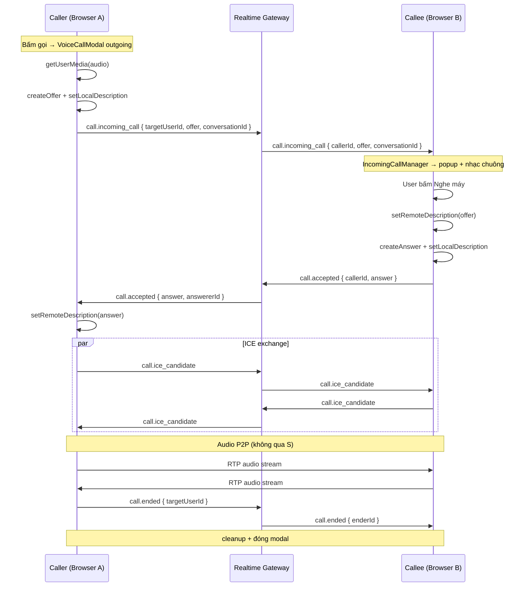

# Gọi thoại 1-1 bằng WebRTC — Lecture đầy đủ

> Tài liệu này mô tả **toàn bộ luồng hoạt động** của chức năng gọi thoại 1-1 trong dự án DALN, dựa trên code hiện tại.  
> Mục tiêu: giúp bạn hiểu **WebRTC là gì**, **tại sao cần signaling server**, và **mỗi file/event xử lý trường hợp nào**.

---

## Mục lục

1. [WebRTC là gì? Tại sao dùng cho gọi thoại?](#1-webrtc-là-gì-tại-sao-dùng-cho-gọi-thoại)
2. [Hai luồng tách biệt: Signaling vs Media](#2-hai-luồng-tách-biệt-signaling-vs-media)
3. [Kiến trúc tổng thể trong dự án](#3-kiến-trúc-tổng-thể-trong-dự-án)
4. [Bản đồ file & trách nhiệm](#4-bản-đồ-file--trách-nhiệm)
5. [Hạ tầng kết nối: Socket.IO](#5-hạ-tầng-kết-nối-socketio)
6. [WebRTC sâu: RTCPeerConnection, SDP, ICE, STUN](#6-webrtc-sâu-rtcpeerconnection-sdp-ice-stun)
7. [Luồng chính: Cuộc gọi thành công (Happy Path)](#7-luồng-chính-cuộc-gọi-thành-công-happy-path)
8. [Tất cả trường hợp trong code hiện tại](#8-tất-cả-trường-hợp-trong-code-hiện-tại)
9. [State machine cuộc gọi](#9-state-machine-cuộc-gọi)
10. [UI & trải nghiệm người dùng](#10-ui--trải-nghiệm-người-dùng)
11. [Giới hạn hiện tại & hướng mở rộng](#11-giới-hạn-hiện-tại--hướng-mở-rộng)
12. [FAQ cho sinh viên](#12-faq-cho-sinh-viên)

---

## 1. WebRTC là gì? Tại sao dùng cho gọi thoại?

**WebRTC** (Web Real-Time Communication) là bộ API trình duyệt cho phép hai peer (thường là hai trình duyệt) **trao đổi audio/video trực tiếp** qua mạng, với độ trễ thấp.

### Điểm quan trọng nhất

WebRTC **không tự biết đối phương ở đâu**. Hai trình duyệt cần một kênh phụ để:

- Thông báo "tôi muốn gọi bạn"
- Trao đổi metadata kỹ thuật (SDP offer/answer)
- Trao đổi địa chỉ mạng (ICE candidates)

Kênh phụ đó gọi là **Signaling**. Trong dự án này, signaling đi qua **Socket.IO** → **Realtime Gateway** (NestJS).

**Media (tiếng nói)** sau khi thiết lập xong thì đi **P2P** (peer-to-peer), **không** đi qua server chat của bạn.

```
┌─────────────┐                              ┌─────────────┐
│  Browser A  │◄────── Audio P2P ──────────►│  Browser B  │
│  (Caller)   │                              │  (Callee)   │
└──────┬──────┘                              └──────┬──────┘
       │                                            │
       │    offer / answer / ICE (signaling)        │
       └──────────────► Server ◄────────────────────┘
                    (chỉ chuyển tin, không xử lý audio)
```

### So sánh nhanh

| Thành phần | Ai xử lý? | Ví dụ trong project |
|------------|-----------|---------------------|
| Bắt micro | Browser (`getUserMedia`) | `useWebRTC.acquireLocalAudio()` |
| Mã hóa & truyền audio | WebRTC engine | `RTCPeerConnection` |
| "Ai gọi ai", offer/answer | Signaling server | `realtime.gateway.ts` |
| UI gọi/nhận/từ chối | React | `VoiceCallModal` |

---

## 2. Hai luồng tách biệt: Signaling vs Media

### Signaling (qua Socket.IO)

Dùng để **điều phối** cuộc gọi:

| Event | Hướng | Ý nghĩa |
|-------|-------|---------|
| `call.incoming_call` | Caller → Server → Callee | "Có cuộc gọi đến, đây là SDP offer" |
| `call.accepted` | Callee → Server → Caller | "Tôi nghe máy, đây là SDP answer" |
| `call.rejected` | Callee → Server → Caller | "Tôi từ chối" |
| `call.ended` | Một bên → Server → Bên kia | "Cuộc gọi kết thúc" |
| `call.ice_candidate` | Hai chiều qua Server | "Đây là địa chỉ mạng của tôi" |

### Media (P2P qua WebRTC)

Sau khi offer/answer khớp và ICE tìm được đường đi:

- Micro A → `MediaStream` → `RTCPeerConnection` → Internet → `RTCPeerConnection` B → loa B
- Ngược lại tương tự (trong audio 1-1, mỗi bên gửi 1 track audio)

**Server không nghe được tiếng nói** trong kiến trúc hiện tại.

---

## 3. Kiến trúc tổng thể trong dự án

```
┌──────────────────────────────────────────────────────────────────┐
│                         FRONTEND (React)                          │
├──────────────────────────────────────────────────────────────────┤
│  App.tsx                                                          │
│    ├── socket.connect() khi user login                           │
│    └── <IncomingCallManager />  ← nghe cuộc gọi đến (global)     │
│                                                                   │
│  ChatPage                                                         │
│    └── onVoiceCall → <VoiceCallModal mode="outgoing" />          │
│                                                                   │
│  VoiceCallModal                                                   │
│    ├── UI (avatar, nút, timeout ring, nhạc chuông)               │
│    ├── useWebRTC()        ← logic WebRTC thuần                     │
│    ├── useCallRingTimeout()                                       │
│    └── useIncomingCallRingtone()                                  │
│                                                                   │
│  lib/socket.ts          ← singleton Socket.IO client             │
└───────────────────────────────┬──────────────────────────────────┘
                                │ WebSocket (namespace: /realtime)
                                ▼
┌──────────────────────────────────────────────────────────────────┐
│              BACKEND: realtime-gateway (NestJS)                   │
├──────────────────────────────────────────────────────────────────┤
│  handleConnection → JWT cookie → join room `user:{userId}`       │
│                                                                   │
│  @SubscribeMessage CALL.* → emitToUserSockets() → room user:X    │
│  (chỉ relay, không lưu call state, không xử lý media)            │
└──────────────────────────────────────────────────────────────────┘
```

### Vai trò từng tầng

1. **UI layer** (`VoiceCallModal`, `IncomingCallManager`, `ChatPage`): người dùng bấm gì, thấy gì.
2. **WebRTC layer** (`useWebRTC`): micro, peer connection, SDP, ICE.
3. **Signaling layer** (`socket` + `realtime.gateway.ts`): chuyển tin giữa hai browser.
4. **Media path**: trực tiếp browser ↔ browser (qua STUN Google).

---

## 4. Bản đồ file & trách nhiệm

### Frontend

| File | Trách nhiệm |
|------|-------------|
| `frontend/src/lib/socket.ts` | Singleton Socket.IO, `autoConnect: false` |
| `frontend/src/lib/socket.events.ts` | Hằng số tên event (khớp backend) |
| `frontend/src/constants/call.ts` | `CALL_RING_TIMEOUT_MS = 30_000` |
| `frontend/src/hooks/useWebRTC.ts` | **Core WebRTC**: peer connection, offer/answer, ICE, cleanup |
| `frontend/src/hooks/useCallRingTimeout.ts` | Đếm ngược N giây khi đang đổ chuông |
| `frontend/src/hooks/useIncomingCallRingtone.ts` | Phát nhạc chuông loop phía callee |
| `frontend/src/components/VoiceCallModal/index.tsx` | UI cuộc gọi (outgoing + incoming) |
| `frontend/src/components/VoiceCallModal/CallRingAvatar.tsx` | Vòng tròn SVG quanh avatar |
| `frontend/src/components/IncomingCallManager/index.tsx` | Bắt `call.incoming_call` toàn app |
| `frontend/src/pages/Chat/index.tsx` | Mở modal outgoing khi bấm nút gọi |
| `frontend/src/App.tsx` | `socket.connect()`, mount `IncomingCallManager` |

### Backend

| File | Trách nhiệm |
|------|-------------|
| `backend/libs/constant/websocket/socket.events.ts` | Định nghĩa event CALL.* |
| `backend/apps/realtime-gateway/src/realtime/realtime.gateway.ts` | Relay signaling qua room `user:{userId}` |

---

## 5. Hạ tầng kết nối: Socket.IO

### Khởi tạo socket (frontend)

```ts
// frontend/src/lib/socket.ts
export const socket = io(SOCKET_URL, {
  transports: ["websocket"],
  withCredentials: true,
  autoConnect: false,  // chỉ connect khi đã login
});
```

### Khi nào socket connect?

```ts
// App.tsx — khi có user.id
useEffect(() => {
  if (!user?.id) return;
  socket.connect();
  return () => socket.disconnect();
}, [user?.id]);
```

### Backend gắn user vào room

Khi client kết nối thành công (`handleConnection`):

1. Đọc JWT từ cookie `accessToken`
2. Lấy `userId`
3. `client.join('user:' + userId)` ← **quan trọng**: mọi event gọi đến user đều emit vào room này

### Relay event (backend)

```ts
private emitToUserSockets(userIds, event, data) {
  for (const userId of userIds) {
    this.server.to(`user:${userId}`).emit(event, data)
  }
}
```

Server **không** parse SDP, **không** validate hai user có phải bạn bè không (chưa có — hướng mở rộng sau).

---

## 6. WebRTC sâu: RTCPeerConnection, SDP, ICE, STUN

### 6.1. RTCPeerConnection

Object trung tâm của WebRTC. Mỗi cuộc gọi, mỗi bên tạo **một** instance:

```ts
const pc = new RTCPeerConnection({
  iceServers: [
    { urls: "stun:stun.l.google.com:19302" },
    { urls: "stun:stun1.l.google.com:19302" },
  ],
});
```

**Lifecycle trong project:**

```
Tạo pc
  → addTrack(audio từ micro)
  → createOffer / createAnswer
  → setLocalDescription
  → (qua signaling) setRemoteDescription
  → trao đổi ICE candidates
  → ontrack → nhận remote audio
  → close khi kết thúc
```

### 6.2. MediaStream & getUserMedia

```ts
const stream = await navigator.mediaDevices.getUserMedia({ audio: true });
```

- Trả về `MediaStream` chứa **track** (ở đây chỉ `audio`, không video).
- Track được `addTrack()` vào `RTCPeerConnection`.
- Khi cleanup: `track.stop()` để tắt micro.

### 6.3. SDP (Session Description Protocol)

SDP là **mô tả phiên** dưới dạng text: codec hỗ trợ, số track, thông số media...

**Offer/Answer model (chuẩn WebRTC):**

| Bước | Bên | Hành động |
|------|-----|-----------|
| 1 | Caller | `createOffer()` → SDP offer |
| 2 | Caller | `setLocalDescription(offer)` |
| 3 | Caller | Gửi offer qua signaling |
| 4 | Callee | `setRemoteDescription(offer)` |
| 5 | Callee | `createAnswer()` → SDP answer |
| 6 | Callee | `setLocalDescription(answer)` |
| 7 | Callee | Gửi answer qua signaling |
| 8 | Caller | `setRemoteDescription(answer)` |

Sau bước 8, cả hai bên biết **muốn trao đổi media kiểu gì** — nhưng chưa chắc **đường mạng nào** để đi.

### 6.4. ICE (Interactive Connectivity Establishment)

Hai máy thường nằm sau NAT/router. ICE giúp tìm **cặp địa chỉ IP:port** có thể kết nối trực tiếp.

**ICE Candidate** = một đường đi tiềm năng (host, srflx qua STUN, relay qua TURN...).

```ts
pc.onicecandidate = (event) => {
  if (event.candidate) {
    socket.emit("call.ice_candidate", {
      targetUserId,
      candidate: event.candidate,
    });
  }
};
```

Bên nhận:

```ts
await peerConnection.addIceCandidate(new RTCIceCandidate(candidate));
```

Trong project, ICE candidates được **relay qua server** giống offer/answer.

### 6.5. STUN là gì?

**STUN** server giúp client biết **IP public** của mình (sau NAT).

Project dùng STUN public của Google — **miễn phí, đủ cho dev/LAN**, nhưng **không đủ** cho mọi môi trường production (symmetric NAT, firewall chặt).

**TURN** (chưa có trong project): relay traffic qua server khi P2P thất bại → cần cho production scale.

### 6.6. ontrack — nghe tiếng đối phương

```ts
pc.ontrack = (event) => {
  setRemoteStream(event.streams[0]);
  setCallStatus("connected");
};
```

`VoiceCallModal` gắn `remoteStream` vào `<audio autoPlay>`:

```tsx
<audio ref={remoteAudioRef} autoPlay playsInline className="hidden" />
```

---

## 7. Luồng chính: Cuộc gọi thành công (Happy Path)

### Bước 0: Điều kiện tiên quyết

- User A và B đều **đã login**
- Socket **đã connect** (`App.tsx`)
- Cả hai **online** (có socket trong room `user:{id}`)
- Cuộc trò chuyện **DIRECT** 1-1

### Bước 1: Caller mở modal outgoing

```
User A trong ChatWindow → bấm nút gọi
  → ChatPage set activeVoiceCall { conversationId, mode: "outgoing" }
  → render <VoiceCallModal mode="outgoing" />
```

### Bước 2: Caller khởi tạo WebRTC + gửi offer

Trong `VoiceCallModal` (outgoing), `useEffect` gọi `startCall(peerUserId, conversationId)`:

```
1. acquireLocalAudio()     → getUserMedia({ audio: true })
2. initPeerConnection()    → new RTCPeerConnection + addTrack
3. createOffer()
4. setLocalDescription(offer)
5. socket.emit("call.incoming_call", { targetUserId, offer, conversationId })
6. callStatus = "calling"
```

UI caller: "Đang gọi...", vòng tròn chạy quanh avatar (30s).

### Bước 3: Server relay tới callee

```
realtime.gateway handleIncomingCall
  → emitToUserSockets([targetUserId], "call.incoming_call", {
      callerId, offer, conversationId
    })
```

### Bước 4: Callee nhận cuộc gọi (global)

`IncomingCallManager` (mount ở `App.tsx`) lắng nghe **mọi trang**:

```
socket.on("call.incoming_call")
  → tìm conversation / friend để lấy tên + avatar
  → setIncomingCall(...)
  → render <VoiceCallModal mode="incoming" callerId offer />
```

Callee thấy:
- Popup "Cuộc gọi đến..."
- Vòng tròn timeout
- Nhạc chuông loop (`useIncomingCallRingtone`)
- Nút xanh Nghe / đỏ Từ chối

### Bước 5: Callee bấm Nghe máy

```
handleAccept()
  → acceptCall(callerId, incomingOffer)
      1. acquireLocalAudio()
      2. initPeerConnection(callerId)
      3. setRemoteDescription(offer)
      4. createAnswer()
      5. setLocalDescription(answer)
      6. emit("call.accepted", { callerId, answer })
      7. callStatus = "connected"
```

Nhạc chuông dừng (vì không còn `isRinging`).

### Bước 6: Caller nhận answer

```
socket.on("call.accepted")
  → handleReceiveAnswer(answer)
  → peerConnection.setRemoteDescription(answer)
  → callStatus = "connected"
```

### Bước 7: ICE traversal (song song)

Cả hai bên, khi `onicecandidate` fire:

```
emit("call.ice_candidate", { targetUserId, candidate })
  → server relay
  → bên kia addIceCandidate()
```

Lặp nhiều lần cho đến khi tìm được đường P2P tốt nhất.

### Bước 8: Audio chảy P2P

```
Caller micro → RTCPeerConnection A ══P2P══ RTCPeerConnection B → Callee loa
Callee micro → RTCPeerConnection B ══P2P══ RTCPeerConnection A → Caller loa
```

`ontrack` fire → `remoteStream` → `<audio>` phát.

### Bước 9: Kết thúc cuộc gọi (một bên bấm cúp máy)

```
handleEndCall()
  → endCall(peerUserId)
      emit("call.ended", { targetUserId })
      cleanup() — close pc, stop tracks
  → onClose() — đóng modal

Bên kia nhận call.ended → cleanup → onClose()
```

### Sequence diagram tổng hợp



---

## 8. Tất cả trường hợp trong code hiện tại

### 8.1. ✅ Callee chấp nhận (Accept)

| | Caller | Callee |
|---|--------|--------|
| Trigger | — | Bấm nút Phone xanh |
| Signaling | Nhận `call.accepted` | Emit `call.accepted` |
| WebRTC | `setRemoteDescription(answer)` | `setRemoteDescription(offer)` + `createAnswer` |
| UI | "Đang trong cuộc gọi" | "Đang trong cuộc gọi" |
| Audio | Nhạc chuông không có (outgoing) | Chuông dừng |

### 8.2. ❌ Callee từ chối (Reject)

| | Caller | Callee |
|---|--------|--------|
| Trigger | — | Bấm PhoneOff đỏ |
| Signaling | Nhận `call.rejected` | Emit `call.rejected { callerId }` |
| WebRTC | `cleanup()` | `cleanup()` |
| UI | Modal đóng ngay | Modal đóng ngay |

Caller **không** thấy màn "Người dùng bận" — chỉ đóng modal (có thể cải thiện hiển thị "Bị từ chối").

### 8.3. ⏱ Timeout — không bắt máy (30 giây)

Constant: `CALL_RING_TIMEOUT_MS = 30_000`

**Phía Caller (outgoing, status `calling`):**

```
handleRingTimeout()
  → endCall(peerUserId, "no_answer")
  → emit call.ended { targetUserId, reason: "no_answer" }
  → setShowBusyResult(true)
  → UI "Người dùng bận" + icon UserX
  → tự đóng sau 2.5 giây (BUSY_DISMISS_MS)
```

**Phía Callee (incoming, status `idle`):**

```
handleRingTimeout()
  → cleanup()
  → onClose() — đóng popup, dừng chuông
```

Callee **không** emit event khi timeout local — caller là bên chủ động gửi `no_answer`.

**Caller nhận `call.ended` với `reason: "no_answer"`** (nếu chưa timeout local): cũng hiện "Người dùng bận".

### 8.4. 📞 Caller hủy khi đang đổ chuông

Caller bấm PhoneOff trong lúc `callStatus === "calling"`:

```
endCall(peerUserId) — không có reason
  → emit call.ended
  → cleanup + onClose
```

Callee nhận `call.ended` → cleanup + onClose (chuông dừng).

### 8.5. 📞 Một bên cúp máy khi đang nói chuyện

`callStatus === "connected"`, bấm PhoneOff:

```
endCall(peerUserId)
  → emit call.ended
  → cleanup + onClose cả hai bên
```

### 8.6. 🔇 Tắt/bật micro (Mute)

Chỉ khi `connected`:

```ts
toggleMute() → audioTrack.enabled = !audioTrack.enabled
```

**Không** gửi signaling — chỉ mute local track. Đối phương **không nghe** tiếng bạn nhưng vẫn trong cuộc gọi.

### 8.7. ⚠️ Lỗi getUserMedia

Nếu user từ chối quyền micro hoặc không có thiết bị:

```
startCall() / acceptCall() throw
  → console.error
  → onClose() — đóng modal
```

### 8.8. ⚠️ Callee offline / socket disconnect

Nếu `targetUserId` không có socket trong room `user:{id}`:

- Server vẫn `emit` nhưng **không ai nhận**
- Caller đợi đến **30s timeout** → "Người dùng bận"

*(Chưa có phản hồi tức thì "offline")*

### 8.9. ⚠️ Incoming khi đang ở trang khác

`IncomingCallManager` gắn ở `App.tsx` → popup vẫn hiện dù user đang ở `/friends`, `/recommendations`, v.v.

### 8.10. ⚠️ Không tìm thấy conversation trong Redux

`IncomingCallManager` vẫn mở popup nhờ fallback:

- `callerDisplayName` từ friend list hoặc "Cuộc gọi đến"
- `conversationId` optional — modal vẫn hoạt động

### 8.11. Bảng tổng hợp event → hành vi UI

| Event nhận được | Mode | callStatus lúc nhận | Hành vi |
|-----------------|------|---------------------|---------|
| `call.accepted` | outgoing | calling | Nhận answer, connected |
| `call.rejected` | outgoing | calling | cleanup, đóng |
| `call.ended` | outgoing | calling + reason no_answer | "Người dùng bận", đóng sau 2.5s |
| `call.ended` | outgoing | calling (khác) | cleanup, đóng |
| `call.ended` | incoming | idle | cleanup, đóng |
| `call.ended` | either | connected | cleanup, đóng |
| `call.ice_candidate` | either | any (có pc) | addIceCandidate |

---

## 9. State machine cuộc gọi

### CallStatus (`useWebRTC`)

```
idle
  │
  ├─ startCall() ──────────────► calling
  │
  ├─ acceptCall() ─────────────► connected (callee, sau khi gửi answer)
  │
calling
  │
  ├─ nhận answer ──────────────► connected
  ├─ reject (bên kia) ────────► (cleanup, modal đóng)
  ├─ endCall(no_answer) ───────► no_answer
  └─ endCall() ────────────────► ended

idle (incoming modal)
  │
  ├─ acceptCall() ─────────────► connected
  ├─ rejectCall() ─────────────► rejected
  └─ timeout ──────────────────► (cleanup, modal đóng)

connected
  │
  └─ endCall() ────────────────► ended
```

### isRinging (UI animation + timeout + chuông)

```ts
isRinging =
  !showBusyResult &&
  (
    (mode === "outgoing" && callStatus === "calling") ||
    (mode === "incoming" && callStatus === "idle")
  )
```

Khi `isRinging === true`:
- Vòng tròn SVG chạy 30s (`CallRingAvatar`)
- `useCallRingTimeout` đếm ngược
- Callee: nhạc chuông loop

---

## 10. UI & trải nghiệm người dùng

### Outgoing (người gọi)

| Giai đoạn | Text | Nút | Animation |
|-----------|------|-----|-----------|
| Đang gọi | "Đang gọi..." | Chỉ PhoneOff (hủy) | Vòng tròn 30s |
| Không bắt máy | "Người dùng bận" | Icon UserX | Dừng vòng |
| Đang nói | "Đang trong cuộc gọi" | Mic, PhoneOff, Loa (disabled) | Không |

### Incoming (người nhận)

| Giai đoạn | Text | Nút | Âm thanh |
|-----------|------|-----|----------|
| Đổ chuông | "Cuộc gọi đến..." | Phone xanh, PhoneOff đỏ | Nhạc chuông loop |
| Đang nói | "Đang trong cuộc gọi" | Mic, PhoneOff, Loa | Im lặng |

### CallRingAvatar

SVG circle dùng `stroke-dashoffset` animation CSS, duration = `CALL_RING_TIMEOUT_MS`.  
Khi vòng khép kín = timeout fire.

---

## 11. Giới hạn hiện tại & hướng mở rộng

### Đã có

- [x] Audio 1-1 P2P
- [x] Signaling qua Socket.IO
- [x] STUN (Google public)
- [x] Incoming call global + nhạc chuông
- [x] Timeout 30s + UI "Người dùng bận"
- [x] Mute local mic

### Chưa có / hạn chế

| Hạng mục | Mô tả |
|----------|-------|
| Video | Chỉ `audio: true`, không video track |
| TURN server | P2P có thể fail sau NAT phức tạp |
| Server call state | Gateway chỉ relay, không lưu Redis session |
| Validate quyền gọi | Chưa check friendship / conversation membership |
| Busy flag | Chưa chặn gọi khi đang trong cuộc gọi khác |
| Ghi âm cuộc gọi | Không |
| Push notification | Callee phải mở web app + socket connect |
| Group call | Chỉ DIRECT 1-1 |
| Reject UI phía caller | Đóng modal, chưa hiện "Bị từ chối" rõ ràng |
| Speaker toggle | Nút loa disabled |

### Hướng mở rộng server "đứng giữa quản lý"

1. Redis `call:{id}` với state `ringing | connected | ended`
2. Validate caller/callee cùng conversation DIRECT
3. Timeout server-side đồng bộ
4. Log miss call → notification service
5. TURN credentials (coturn) cho production

---

## 12. FAQ cho sinh viên

### Q1: Tại sao cần server nếu WebRTC là P2P?

Server chỉ giúp hai browser **tìm và thỏa thuận với nhau** (signaling). Giống người môi giới đưa danh thiếp — sau khi hai người gặp mặt thì nói chuyện trực tiếp, không cần môi giới nghe.

### Q2: Offer và Answer khác gì?

- **Offer**: "Tôi muốn thiết lập phiên, đây là khả năng của tôi"
- **Answer**: "OK, tôi đồng ý với điều kiện này"

Luôn do caller tạo offer, callee tạo answer.

### Q3: ICE candidate là gì?

Một **địa chỉ mạng cụ thể** mà peer có thể dùng để kết nối. NAT làm mỗi máy có nhiều địa chỉ — ICE thử lần lượt tìm đường tốt nhất.

### Q4: Tại sao dùng `useRef` cho `localStream` trong useWebRTC?

`startCall` có thể chạy ngay sau `acquireLocalAudio`. Ref đảm bảo `initPeerConnection` luôn đọc stream mới nhất khi `addTrack`, tránh stale closure từ React state.

### Q5: Tại sao socket là singleton import trực tiếp?

Socket là side effect bên ngoài React tree. Module chỉ khởi tạo một lần → mọi component dùng chung một kết nối. Chi tiết: xem `frontend/src/lib/socket.ts`.

### Q6: Media có đi qua NestJS không?

**Không.** NestJS gateway chỉ chuyển JSON (offer, answer, candidate). Audio đi UDP/RTP trực tiếp giữa browsers (sau ICE).

### Q7: Làm sao debug khi không nghe được tiếng?

1. Chrome DevTools → `chrome://webrtc-internals`
2. Kiểm tra `ICE connection state` có `connected` không
3. Kiểm tra `ontrack` có fire không
4. Kiểm tra quyền micro
5. Thử hai máy cùng mạng LAN trước
6. Nếu khác mạng fail → cần TURN

### Q8: `cleanup()` quan trọng thế nào?

Nếu không gọi:
- Micro vẫn bật (đèn đỏ laptop)
- `RTCPeerConnection` leak
- Socket listeners chồng chéo nếu gọi lại

`cleanup()` đóng pc, stop tracks, reset state.

---

## Phụ lục A — Payload chi tiết từng event

### Client → Server

**`call.incoming_call`**
```json
{
  "targetUserId": "userId của người nhận",
  "offer": { "type": "offer", "sdp": "..." },
  "conversationId": "optional — để callee hiển thị đúng hội thoại"
}
```

**`call.accepted`**
```json
{
  "callerId": "userId người gọi",
  "answer": { "type": "answer", "sdp": "..." }
}
```

**`call.rejected`**
```json
{ "callerId": "userId người gọi" }
```

**`call.ended`**
```json
{
  "targetUserId": "userId đối phương",
  "reason": "no_answer | undefined"
}
```

**`call.ice_candidate`**
```json
{
  "targetUserId": "userId đối phương",
  "candidate": { "candidate": "...", "sdpMid": "...", "sdpMLineIndex": 0 }
}
```

### Server → Client

**`call.incoming_call`**
```json
{
  "callerId": "từ JWT socket người gửi",
  "offer": { ... },
  "conversationId": "optional"
}
```

**`call.accepted`**
```json
{
  "answer": { ... },
  "answererId": "userId người nghe máy"
}
```

**`call.rejected`**
```json
{ "rejecterId": "userId người từ chối" }
```

**`call.ended`**
```json
{
  "enderId": "userId người kết thúc",
  "reason": "no_answer | undefined"
}
```

**`call.ice_candidate`**
```json
{
  "senderId": "userId người gửi candidate",
  "candidate": { ... }
}
```

---

## Phụ lục B — Thứ tự đọc code đề xuất

1. `frontend/src/lib/socket.ts` — hiểu kết nối
2. `backend/.../realtime.gateway.ts` — `handleConnection` + CALL handlers
3. `frontend/src/hooks/useWebRTC.ts` — **trái tim WebRTC**
4. `frontend/src/components/IncomingCallManager/index.tsx` — callee vào cửa
5. `frontend/src/pages/Chat/index.tsx` — caller vào cửa
6. `frontend/src/components/VoiceCallModal/index.tsx` — UI + tất cả edge cases

---

*Tài liệu đồng bộ với codebase tại thời điểm viết. Khi thêm TURN, video, hoặc server call session — cập nhật mục 11 và sequence diagram.*
